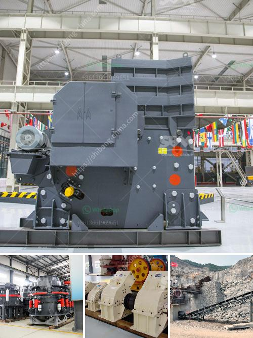

<h3>stone crusher zone in nepal</h3>
The ban on sand and stone exports to India was relaxed only 100 days after it was first implemented, but has dealt the crusher industry a near-fatal blow, crushing plants illegally operating in Dolakha's Kalinchowk of Nepal still operating as they did too close to the stone crushing plants.

Following a public interest litigation filed by Himal River Conservation Foundation, a stone crusher operating illegally at Yamuna River in the Kavrepalanchowk district was ordered to shut down.

The Ministry of Forest and Environment, Bagmati province government, and local Balaju and Kakani rural municipalities in supporting the case found it to be a clear evidence of environmental degradation and a menace to public health.

This highlights a major issue when it comes to stone crusher industries in Nepal, that is the pollution emitted by these industries, affecting the local communities and the environment.

A stone crusher zone is a designated area for stone crushing industry. It is located about 300 meters from the outskirts of the city of Bharatpur and is surrounded by a stone-studded bed of the Bagmati River, known as the Kaligandaki River.

The area has been in operation since the early 2000s when the crushers first appeared, and is still being operated illegally, without permission, by the owners who have managed to evade authorities.

The stone crusher zone is located within a large flowing river which is one of the reasons for environmental degradation. The stones are extracted from the river and crushed into smaller sizes to be used in various construction projects. However, this process releases a significant amount of dust and pollutants into the air, causing health hazards for the nearby residents.

The dust particles emitted from stone crushers contain harmful particles such as silica, which cause respiratory problems and can lead to lung diseases such as silicosis. This issue has been raised multiple times, and measures have been taken by the government to address it.

However, the problem persists due to the lack of strict enforcement and monitoring by the concerned authorities. The illegal operation of stone crusher industries in the stone crusher zone is a clear violation of the laws and regulations set by the government.

The negative impact of stone crusher industries on the environment and public health cannot be undermined. Stone crusher zones should be strictly regulated and monitored to ensure their compliance with environmental standards. Additionally, stone crushers should be required to implement measures to minimize the pollution generated during the crushing process.

The government of Nepal should take immediate action to shut down the illegal stone crusher industries operating in the stone crusher zone. The authorities should also conduct regular inspections and strictly enforce the laws related to stone crusher industries.

Moreover, the stone crusher zone should be relocated to a suitable location away from residential areas and critically sensitive ecosystems. This will help in preserving the environment and protecting the health and well-being of the local residents.

In conclusion, the stone crusher zone in Nepal is facing numerous challenges due to its illegal operation and the pollution it generates. The government and concerned authorities should take prompt action to address these issues and bring the stone crusher industries into compliance with environmental regulations. This will contribute to safeguarding the environment and promoting the well-being of the local communities.
<h3>Contact us</h3><ul><li><strong>Whatsapp:&nbsp;<a href="https://wa.me/8613661969651">+8613661969651</a></strong></li><li><a href="https://swt.shibang-china.com/?git&amp;zhl&amp;stone crusher zone in nepal"><strong>Online Service(chat now)</strong></a></li></ul><h3>Related</h3><ul><li><a href='industrial mills in mexico.md'>industrial mills in mexico</a></li><li><a href='limestone grinding machine.md'>limestone grinding machine</a></li><li><a href='ethiopia conveyor belts china.md'>ethiopia conveyor belts china</a></li><li><a href='talcum powder mill manufacturing.md'>talcum powder mill manufacturing</a></li><li><a href='ball mill manufacture in chennai.md'>ball mill manufacture in chennai</a></li></ul>