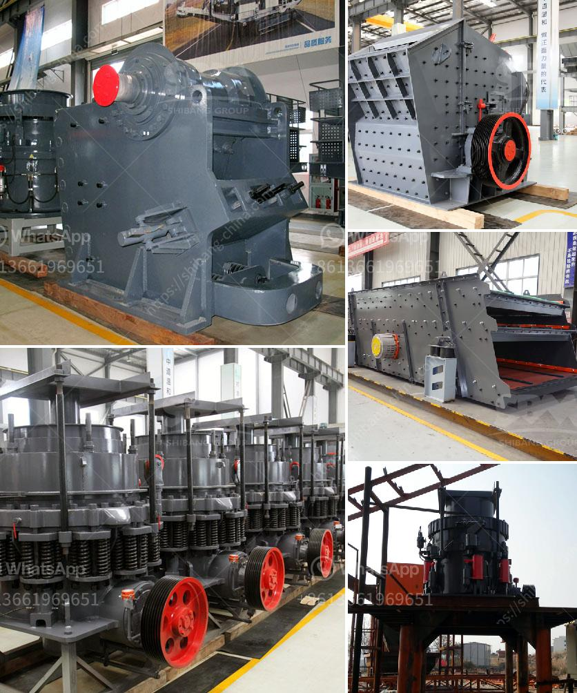

<h3>stone crushers for sale in kenya</h3>
Stone crushers are machines that are designed to crush large rocks into smaller ones. The machines use an impact principle to break and grind rocks into smaller stones. These are often used for gravel, sand, or rock dust. Depending on the requirement of the operation and material being crushed, the different types of stone crushers offer different advantages such as:

- Jaw crushers: Jaw crushers are the popular primary crushers in small processing plants, owing to the features of simple structure and easy operation. In addition, the cost of wearing parts is less than that of other complicated casting crushers. List of few well-known mining rock crusher brands: , , Sandvik crusher.

- Cone crushers: Cone crushers crush the ores and rocks by pressing them against each other until they break apart. Cone crushers are used in large primary ore crushing, secondary, and tertiary fine material, as well as complete aggregate cone crushing lines. List of few well-known mining rock crusher brands: , Metso, Sandvik crusher.

- Sometimes referred to as a gyratory crusher, a cone crusher is one of the main types of primary crushers in a mine or ore processing plant. Gyratory crushers are designated in size either by the gape and mantle diameter or by the size of the receiving opening. Gyratory crushers can be used for primary or secondary crushing. List of few well-known mining rock crusher brands: , Metso, Sandvik crusher.

- Sometimes known as a toggle crusher, jaw crushers use 'jaws', fixed and the other moving, to move ore down a tapered chute so material is crushed progressively in to smaller pieces. A weighted flywheel moves the material to generate the required energy to crush material. Jaw crushers are widely used in Mining, Aggregate, Demolition, Industrial, Construction and Environmental industries. List of few well-known mining rock crusher brands: , Sandvik crusher, Metso, Sandvik crusher, Kleemann crusher, MC series crusher, TESAB crusher, etc.

The working principle of these stone crushers is that the motor drives the belt and pulley to move the movable jaw up and down through the eccentric shaft. When the movable jaw rises, the angle between the toggle plate and the movable jaw becomes larger, thereby pushing the movable jaw plate closer to the fixed jaw plate, and the material passes through the two jaws. This process is repeated until the material is crushed to the required particle size and discharged through the discharge port.

Stone crushers are widely used in construction sites, mine sites, and stone quarries. It crushes large stones into smaller pieces to be used in subsequent construction activities. Stone crushers are immensely effective, they break down stones into smaller pieces that can be used for road and building construction purposes. Stone crushers are a vital component of the construction industry, as they have a reduced lifespan compared to other heavy machinery.

The stone crusher price is determined by the respective factors. The stone crusher price is determined by the brand, shipping cost, quality, capacity, and spare parts accessibility. Stone crusher plants are available in two major types namely (a) stationary (b) portable or mobile. However, you can establish stationary crushers at quarry heads. Mainly, at the construction site, you can use the portable crushers. Here we have explained the stationary stone crusher plant details. Stone boulders are the only raw material required for the stone crusher plant.

The investment for stone crusher in Kenya varies depending on the type of crusher being used and the market conditions. On average, the investment for a fixed stone crusher plant ranges from US$100,000 to US$1,000,000. To help you estimate the best price, we provide comprehensive stone crusher plant prices according to your specific requirements.

We are a professional stone crushing equipment manufacturer from China, has produced the advanced mining crushing machine for the processing plant. SBM stone crushing equipments are of advanced design with a small footprint and high capacity in relation to size. They have high reduction efficiency and give very good product shape. We provide full technical service to assist our clients in all aspects of stone crushing. Please contact us for more information.
<h3>Contact us</h3><ul><li><strong>Whatsapp:&nbsp;<a href="https://wa.me/8613661969651">+8613661969651</a></strong></li><li><a href="https://swt.shibang-china.com/?git&amp;zhl&amp;stone crushers for sale in kenya"><strong>Online Service(chat now)</strong></a></li></ul><h3>Related</h3><ul><li><a href='gypsum chromium limestone mining.md'>gypsum chromium limestone mining</a></li><li><a href='quartz crushing project report.md'>quartz crushing project report</a></li><li><a href='ball mill 10 tph.md'>ball mill 10 tph</a></li><li><a href='gold mining equipment in south africa for sale.md'>gold mining equipment in south africa for sale</a></li><li><a href='pulveriser quartzite china make.md'>pulveriser quartzite china make</a></li></ul>