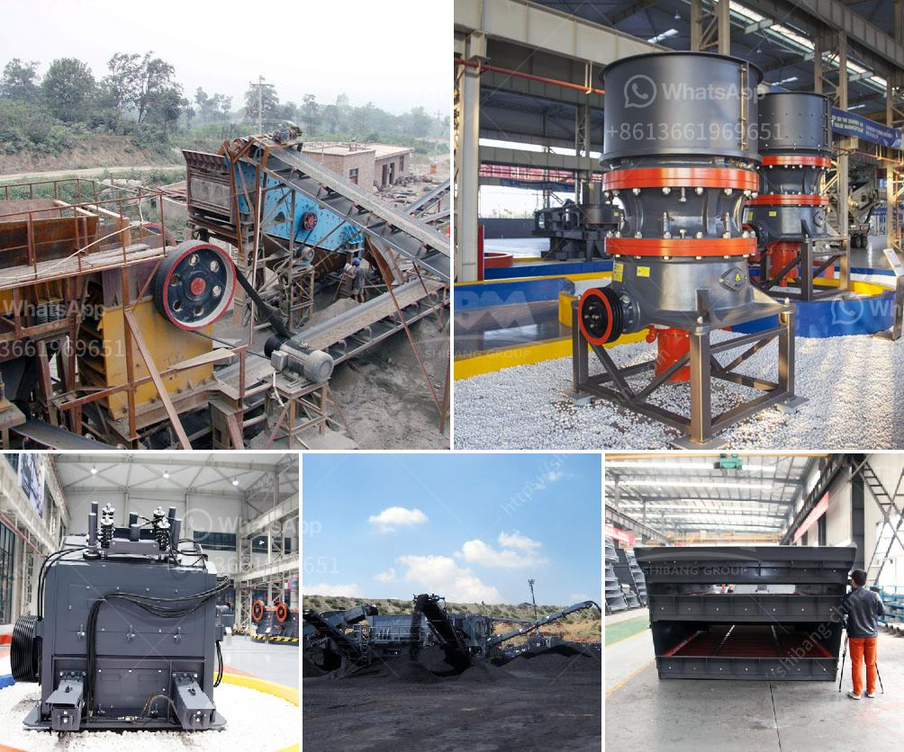

<h3>stone crushers for sale italy</h3>
Stone crushers are widely used in mining, metallurgy, building materials, highways, railways, water conservancy and chemical industries. And the current market is filled with various types of stone crushers, as well as several new models that are contributing to the market growth. In Italy, specifically, there has been a steady rise in the demand for stone crushers over the years. This article will focus on stone crushers for sale in Italy, exploring their production capacity, cost, and other benefits.

Firstly, stone crushers can be categorized into primary crushing, secondary crushing, and tertiary crushing machines. Primary crushers aim to process large stones into smaller sizes for further crushing stages. In Italy, stationary stone crushers are being replaced by mobile or portable machines. These crushers allow operators to move the unit closer to the quarrying site, reducing unnecessary transportation costs. Furthermore, these portable stone crushers can also be easily transported to different locations, making them ideal for contractors or quarry owners who need to move their equipment from one site to another.

Secondly, stone crushers for sale in Italy come with multiple features, including high reliability, durability, and easy maintenance. This allows for efficient performance even under harsh conditions. These crushers are designed with a heavy-duty construction, making them highly resistant to wear and tear. Moreover, they are equipped with advanced technologies such as hydraulic systems and electronic control panels, ensuring smooth and efficient operation.

In terms of cost, stone crushers for sale in Italy vary based on different models and manufacturers. However, the prices of stone crushers in Italy tend to be lower than those in other countries. This is primarily due to the long-standing tradition of manufacturing stone crushers by Italian companies, which have a strong reputation in the industry. Additionally, the competition among manufacturers in Italy also contributes to the affordability of these machines. Buyers can find a variety of stone crushers for sale in Italy, ranging from basic models to high-end ones, depending on their specific needs and budget.

Lastly, stone crushers for sale in Italy have several environmental advantages. For instance, they can crush stones into gravel, which can be used as building materials or as an ingredient in concrete production. This helps to reduce the demand for natural aggregates, which are often obtained through mining. Furthermore, certain stone crushers are equipped with dust suppression systems, minimizing the release of harmful dust particles into the atmosphere. This not only protects the health of workers but also reduces pollution levels in the surrounding areas.

In conclusion, stone crushers for sale in Italy offer numerous benefits, including mobility, high reliability, durability, affordability, and environmental advantages. With the continuous growth of the construction industry, the demand for stone crushers is expected to increase in Italy and other countries. Therefore, investing in a stone crusher can be a profitable choice for businesses or individuals looking to expand their operations.
<h3>Contact us</h3><ul><li><strong>Whatsapp:&nbsp;<a href="https://wa.me/8613661969651">+8613661969651</a></strong></li><li><a href="https://swt.shibang-china.com/?git&amp;zhl&amp;stone crushers for sale italy"><strong>Online Service(chat now)</strong></a></li></ul><h3>Related</h3><ul><li><a href='granite mining machinery.md'>granite mining machinery</a></li><li><a href='chrome crushing plant.md'>chrome crushing plant</a></li><li><a href='process flow diagram for kaolin calcining using kiln.md'>process flow diagram for kaolin calcining using kiln</a></li><li><a href='copper ore processing plants in pakistan.md'>copper ore processing plants in pakistan</a></li><li><a href='maintenance plan of crusher.md'>maintenance plan of crusher</a></li></ul>