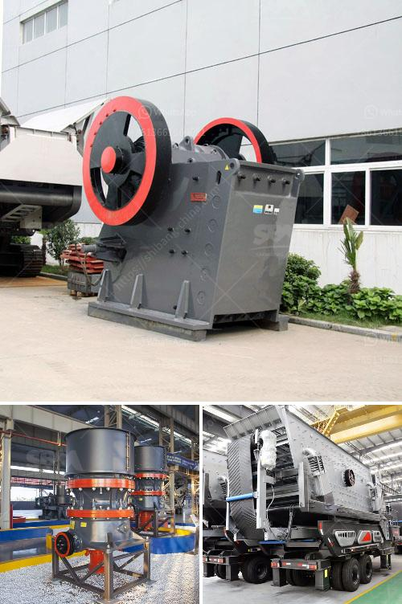

<h3>stone crushers manufacturer</h3>
Stone crushers are heavy machinery designed to break the stone into different sizes. There are different types of stone crushers in the market, each with its own strength and range of applications. Some types of stone crushers are fixed, while others are mobile and can be easily moved from one location to another. These versatile machines are indispensable in various construction projects and mining operations.

One of the leading stone crushers manufacturers in the industry is Metso. Metso’s stone crushers are specifically designed to provide high-quality and reliable performance. These crushers are widely used in mining, construction, metallurgy, chemical, and other industries. Due to their high efficiency and reliability, they are highly favored by customers all over the world.

Metso offers a wide range of stone crushers, including jaw crushers, cone crushers, impact crushers, mobile crushers, and grinders. Each kind of crusher has its own unique features. Jaw crushers are often used in medium and large-scale construction projects because of their strong crushing capacity and wide range of applications. Cone crushers, on the other hand, are more efficient and are better suited for crushing hard and abrasive materials. Impact crushers are especially suitable for producing aggregates for road construction, railway ballast, and concrete.

Metso stone crushers come in different sizes and capacities, depending on the desired output. Whatever the case, Metso stone crushers are designed to handle rocks of all shapes and sizes with high efficiency. Crushing materials that include rock, puzzolana, gravel, limestone, coal, iron ore, construction and demolition wastes, and other mineral raw materials.

The purpose of the crushing process plant is to obtain different rock sizes or mineral mining. JXSC has rich experience in the stone crusher plant layout and solutions. Since 1985, We have successfully installed many stone production lines with different outputs, such as 60tph, 100t/h, 200tph, 500tph. The global stone crushing equipment market is expected to witness significant growth over the forecast period. Stone crushing equipment is used to lower the size, or to change the shape of the raw material mix by breaking down the stones into small pieces.

The crushing equipment is made up of metal surfaces that are capable of compressing materials, such as stones, quartzite, rocks, iron, etc. The stone crushing machines are used in various fields such as building materials, mining, metallurgy, highways, chemistry, railways, as well as continuous requirement from construction activities, such as highways, roads, canals, buildings, and bridges, etc. Growing construction activities, steady growth of economies, as well as continuous development of roads and highways globally is expected to fuel the demand for stone crushing equipment during the forecast period.

Metso is a leading manufacturer of stone crushers and screening equipment. Metso is also a key player in the hydraulic attachment market. Metso is classified as a global market leader in the production and distribution of concrete crushers and shears. The company designs specific attachments for compact track loaders, skid steers, wheel loaders, excavators, and backhoes.

Metso offers a range of jaw crushers for different feed and grain sizes and performance capacity. The single toggle jaw crusher of the STR type has openings up to 1600 x 2100 mm in size. The maximum feed capacity is up to 1500 t/h. Metso’s stone crushers are designed to achieve larger productivity and higher crushing ratio. We have jaw crushers, impact crushers, cone crushers, sand makers, and so on. They can meet various production needs through free combinations. 

Metso's stone crushers are suitable for crushing high hard, mid hard and soft rocks and ores such as iron ore, limestone, slag, marble, quartz, granite, cement, clinker, coal and so on. Stone crushers are widely used in mining, smelting, building materials, highways, railways, water conservancy and chemical industries, etc. And the maximum compressive strength of the crushed material is 320 MPa.
<h3>Contact us</h3><ul><li><strong>Whatsapp:&nbsp;<a href="https://wa.me/8613661969651">+8613661969651</a></strong></li><li><a href="https://swt.shibang-china.com/?git&amp;zhl&amp;stone crushers manufacturer"><strong>Online Service(chat now)</strong></a></li></ul><h3>Related</h3><ul><li><a href='gold mining equipment stores in tanzania.md'>gold mining equipment stores in tanzania</a></li><li><a href='jual crusher batubara di indonesia.md'>jual crusher batubara di indonesia</a></li><li><a href='cement plant machine.md'>cement plant machine</a></li><li><a href='calcium carbonate powder crushing crusher usa.md'>calcium carbonate powder crushing crusher usa</a></li><li><a href='graphite processing flowsheet.md'>graphite processing flowsheet</a></li></ul>