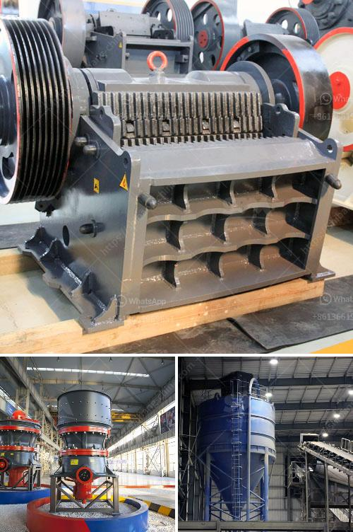

<h3>stone crushing and screening plant</h3>
A stone crushing and screening plant is a valuable asset for the construction industry, ensuring that stones are crushed and screened to produce high-quality construction materials. These plants are specifically designed to produce crushed stones of specific sizes and shapes, ensuring efficient production and processing.

Stone crushing and screening plants are effective facilities for crushing all types of stones which are determined as raw material. Generally, these plants include crushers, screens, feeders, and conveyors used to crush and segregate the materials into different sizes. The crushed stone is used for various applications in the construction industry, such as highways, buildings, bridges, and railways.

One of the primary advantages of a stone crushing and screening plant is its versatility. It can handle a wide variety of materials, including limestone, basalt, granite, river pebble, and more. The plant can produce and screen different sizes of stones to meet the specific requirements of various construction projects.

Stone crushing and screening plants utilize several types of crushers, such as jaw crushers, cone crushers, impact crushers, and mobile crushers. These plants can be stationary or mobile, providing an efficient and convenient solution for dealing with huge amounts of stone.

The crushing stage in a stone crushing and screening plant is crucial because it prepares the stones for further processing. Screening ensures that the stones are evenly graded and sieved to different specifications. The conveyor system plays an important role in the transportation of materials between crushing and screening stages.

Stone crushing and screening plants require less maintenance compared to other mining and quarrying plants, which makes them an ideal choice for many businesses. Not only do they save time and effort, but they also reduce operational costs. These plants are equipped with durable and reliable components that can handle the rugged conditions of a mining or quarrying site.

Additionally, stone crushing and screening plants are environmentally friendly due to their low noise and dust emissions. Several dust control measures, such as water sprinklers and dust suppression systems, are implemented to minimize airborne dust particles. This makes the plants ideal for use in urban areas, where environmental concerns are paramount.

In conclusion, a stone crushing and screening plant is a versatile tool for the construction industry, providing an efficient and reliable method of producing high-quality construction materials. These plants can significantly reduce operational costs, save time, and contribute to environmental sustainability. Whether used for road construction, building projects, or railway tracks, these plants play a vital role in the infrastructure development of any country.
<h3>Contact us</h3><ul><li><strong>Whatsapp:&nbsp;<a href="https://wa.me/8613661969651">+8613661969651</a></strong></li><li><a href="https://swt.shibang-china.com/?git&amp;zhl&amp;stone crushing and screening plant"><strong>Online Service(chat now)</strong></a></li></ul><h3>Related</h3><ul><li><a href='stone crusher with tractor.md'>stone crusher with tractor</a></li><li><a href='stone quarry equipment price in ethiopia.md'>stone quarry equipment price in ethiopia</a></li><li><a href='mobil rock pulverizer.md'>mobil rock pulverizer</a></li><li><a href='coal wash plant indonesia.md'>coal wash plant indonesia</a></li><li><a href='dorries vertical grinders used for sale europe.md'>dorries vertical grinders used for sale europe</a></li></ul>