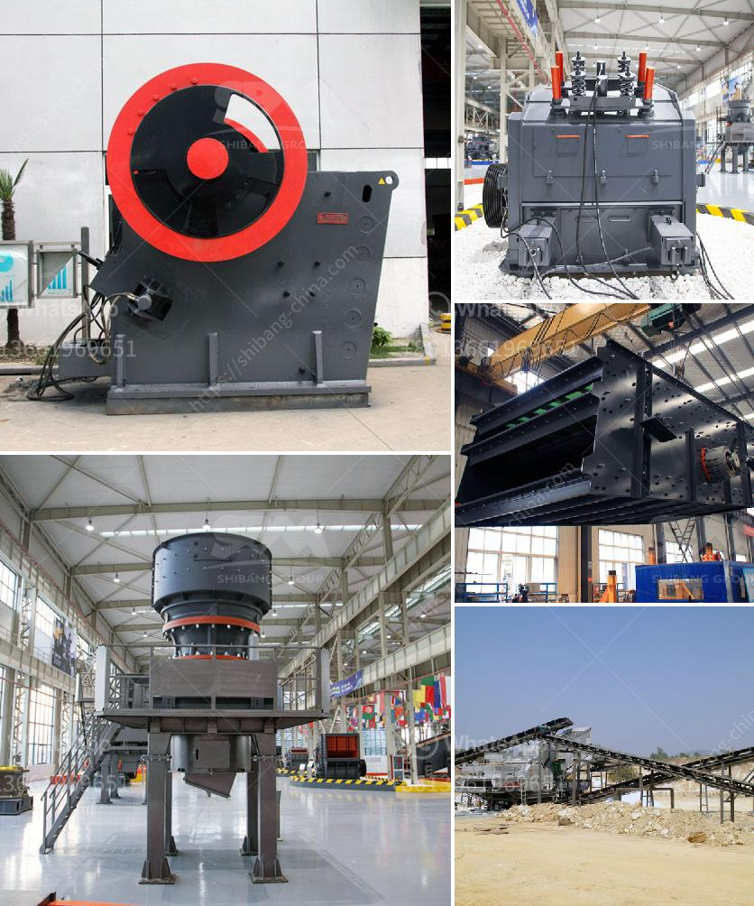

<h3>stone crushing company in philippines</h3>
Stone crushing industry is an important industrial sector in the country engaged in producing crushed stone of various sizes depending upon the requirement which acts as raw material for various construction activities such as construction of roads, highways, bridges, buildings, canals etc. It is estimated that there are over 12,000 stone crusher units in Philippines serving different industries.

The stone crushing company intends to produce crushed stones of various sizes for construction purposes using state-of-the-art crushing equipment. This equipment includes jaw crushers for coarse crushing, cone crushers for fine crushing, vibrating screens, and conveyor belts. These machines are all operated by experienced personnel to ensure quality output.

The stone crushing industry is competitive as the demand for crushed stones continues to increase rapidly. This is due to the fact that new construction projects are being developed on a regular basis. To remain competitive, the company is investing in modern equipment and technology to ensure that they can meet the increasing demand for crushed stones in the Philippines.

Apart from meeting the demand for crushed stones, the stone crushing company is also committed to preserving the environment and ensuring sustainable practices. They employ various measures to minimize dust, noise, and other environmental impacts associated with stone crushing operations. Additionally, they also actively participate in community development initiatives to give back to the communities they operate in.

The stone crushing company in Philippines contributes significantly to the local economy by providing employment opportunities for skilled and unskilled workers. They also contribute to the government revenue through payment of taxes and fees.

In conclusion, the stone crushing company in the Philippines plays a vital role in the construction industry. They provide essential materials for various construction projects, employ a large number of workers, and contribute to the local economy. As the demand for crushed stones continues to rise, stone crushing companies in the Philippines must strive to meet the demand while also focusing on sustainable practices to preserve the environment.
<h3>Contact us</h3><ul><li><strong>Whatsapp:&nbsp;<a href="https://wa.me/8613661969651">+8613661969651</a></strong></li><li><a href="https://swt.shibang-china.com/?git&amp;zhl&amp;stone crushing company in philippines"><strong>Online Service(chat now)</strong></a></li></ul><h3>Related</h3><ul><li><a href='processing of delomite powder mill.md'>processing of delomite powder mill</a></li><li><a href='products scm ultrafine mill.md'>products scm ultrafine mill</a></li><li><a href='mobile stone crusher machine price and cost.md'>mobile stone crusher machine price and cost</a></li><li><a href='stone crusher with tractor.md'>stone crusher with tractor</a></li><li><a href='used washing gold plants for sale in europe.md'>used washing gold plants for sale in europe</a></li></ul>