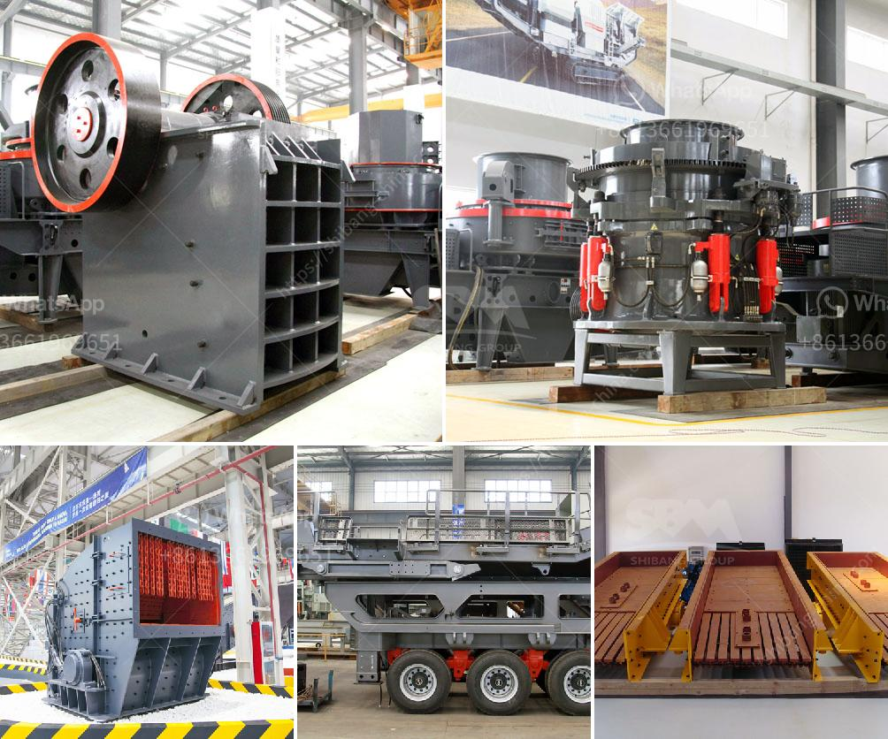

<h3>stone crushing equipment available</h3>
Stone crushing equipment is used to reduce the size, or to change the shape of the raw material mix by breaking down the stones into small pieces, so that they are easily differentiated for the desired end use. The crushing equipment operates by applying compressive strength to the material and crushing it by means of collisions between the machine and the materials.

The stone crushing machines find applications in various fields such as building materials, mining, metallurgy, highways, chemistry, railways, etc. based on the requirement put forth by the type of construction activity such as highways, roads, canals, buildings, and bridges, etc.

The stone crushing equipment can produce different sizes of crushed stone. With the current growth rate of global urbanization, the stone crushing equipment market is anticipated to witness a surge in demand for crushers applied in construction of infrastructure and other activities.

As per the Asian Development Bank data, the Asian region accounted for 59% of the global construction spending in 2019, which is expected to increase in the coming years. This rise in construction activities is driving the demand for stone crushing equipment in the region.

Various types of stone crushers are available in the market, which can be used for crushing specific materials. Each type has its own unique characteristics and advantages. For example, jaw crushers are ideal for primary crushing applications, while impact crushers are better suited for secondary or tertiary crushing. Cone crushers are suitable for crushing materials with high hardness and high abrasiveness.

In conclusion, stone crushing equipment can be used for different applications, varying from building construction to mining and other sectors. It is essential to choose the right equipment that suits your needs in order to ensure optimal productivity and efficiency. The stone crushing equipment market is expected to witness lucrative growth in the forecast period due to the increasing construction activities globally.
<h3>Contact us</h3><ul><li><strong>Whatsapp:&nbsp;<a href="https://wa.me/8613661969651">+8613661969651</a></strong></li><li><a href="https://swt.shibang-china.com/?git&amp;zhl&amp;stone crushing equipment available"><strong>Online Service(chat now)</strong></a></li></ul><h3>Related</h3><ul><li><a href='german crusher for sale.md'>german crusher for sale</a></li><li><a href='jaw crushers zimbabwe.md'>jaw crushers zimbabwe</a></li><li><a href='used ball mills in india.md'>used ball mills in india</a></li><li><a href='iron ore wet processing plant.md'>iron ore wet processing plant</a></li><li><a href='700t h mobile crusher.md'>700t h mobile crusher</a></li></ul>