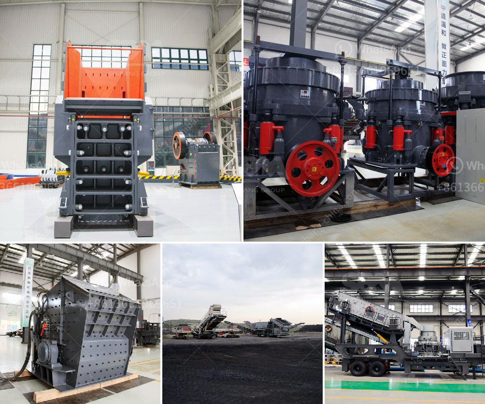

<h3>stone crushing industry tanzania</h3>
Tanzania, known for its vast reserves of minerals, offers a thriving stone crushing industry in the country. The industry not only provides employment opportunities to thousands of people but also contributes significantly to the nation's economy. The stone crushing process is laborious and requires a lot of manpower, making it a lucrative industry for many individuals.

Tanzania is currently experiencing a construction boom due to the growing demand for infrastructure development. This has led to a surge in the demand for stones of various sizes used in the construction of roads, buildings, and other infrastructure projects. As a result, stone crushing units have become an essential part of the industry, providing the necessary materials for these projects.

Stone crushing in Tanzania is typically done with jaw crushers. These machines are used to break large stones into smaller, finer pieces. The crushed stone is then used as raw material for various construction activities such as building houses, roads, bridges, and highways. The process of crushing stones involves feeding them into a jaw crusher, where they are subjected to constant pressure until they are broken down into smaller sizes.

In addition to providing materials for construction, the stone crushing industry also contributes to the country's economic growth by generating employment opportunities. Stone crushing units require a significant amount of manpower, creating jobs for skilled and unskilled workers alike. Furthermore, the industry also directly supports other related sectors such as transportation and manufacturing, as the crushed stones are transported to various construction sites and used in the production of concrete and other building materials.

However, despite its economic benefits, the stone crushing industry also presents challenges that need to be addressed. One such challenge is the environmental impact of stone crushing activities. The extraction and crushing of stones can lead to soil erosion, air pollution, and deforestation. It is therefore important for stone crushing units to adopt environmentally friendly practices and adhere to regulations to minimize their negative impact on the environment.

In conclusion, the stone crushing industry in Tanzania plays a vital role in supporting the nation's development by providing the necessary materials for infrastructure projects and generating employment opportunities. However, it is crucial for the industry to prioritize environmental sustainability and adopt sustainable practices to mitigate any negative impacts. By striking the right balance between economic growth and environmental preservation, Tanzania can ensure the long-term success of its stone crushing sector.
<h3>Contact us</h3><ul><li><strong>Whatsapp:&nbsp;<a href="https://wa.me/8613661969651">+8613661969651</a></strong></li><li><a href="https://swt.shibang-china.com/?git&amp;zhl&amp;stone crushing industry tanzania"><strong>Online Service(chat now)</strong></a></li></ul><h3>Related</h3><ul><li><a href='manufacturers of conveyor belts in malaysia.md'>manufacturers of conveyor belts in malaysia</a></li><li><a href='basalt crusher plant price.md'>basalt crusher plant price</a></li><li><a href='basalt processing line.md'>basalt processing line</a></li><li><a href='m sand manufacturing project report.md'>m sand manufacturing project report</a></li><li><a href='used stone crushing equipment in assam.md'>used stone crushing equipment in assam</a></li></ul>