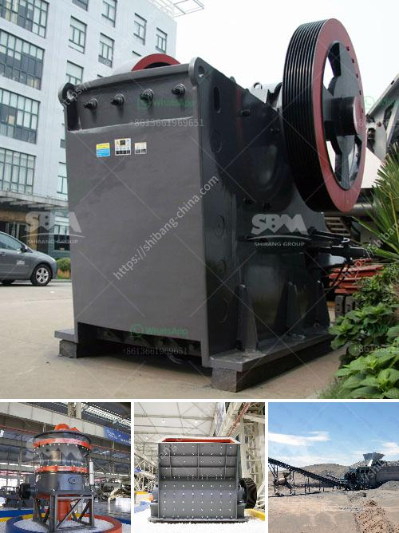

<h3>stone crushing machine manufacturers in japan</h3>
Stone crushing machines have been widely used in Japan since the late 19th century. Nowadays, they are a vital part of many industrial sectors in Japan such as mining, construction, and metallurgy. These machines can process various kinds of stones, gravel, and sand into different sizes for use in various industries. For instance, the construction industry uses stone crushing machines for breaking down large rocks for building roads and bridges, whereas the mining industry uses them to crushing rocks into smaller sizes for mineral extraction.

In Japan, the history of stone crushing machines can be traced back to the early 1860s. In its development, the industry's manufacturers have introduced various types of machines including jaw crushers, impact crushers, and cone crushers, as well as high-pressure grinding rolls and vertical shaft impactors. With technological advancements, stone crushing machines have become more efficient and less time-consuming.

One of the notable stone crushing machine manufacturers in Japan is Shibang Machinery Co., Ltd. Since its establishment in 1987, Shibang has been focusing on the research and development of mining machinery. Shibang's stone crushing machines have been exported to over 120 countries, and they are widely used in global mining and construction industry.

In Japan, Shibang has collaborated with several local manufacturers to support and service its stone crushing machines. For instance, Kobe Steel, one of Japan's leading steel manufacturers, has partnered with Shibang to improve the design and functionality of its crushers. This collaboration has enabled Shibang's crushers to have a higher crushing efficiency, longer lifespan, and lower maintenance costs.

Another well-known stone crushing machine manufacturer in Japan is Komatsu. Komatsu produces various types of crushers, including cone crushers, jaw crushers, and impact crushers. Komatsu's crushers are highly regarded for their high productivity and durability. They are widely used in the mining, construction, and quarrying industries in Japan.

However, it's important to note that stone crushing machines are not only used in Japan but also in various other countries around the world. Their popularity can be attributed to their ability to crush stones into different sizes, allowing for easy processing and use in various applications. Stone crushing machines have revolutionized the mining and construction industries by increasing productivity and efficiency.

In conclusion, stone crushing machine manufacturers in Japan are continuously pioneering and improving their machines to cater to the needs of various industries. These machines have played a crucial role in the development of infrastructure and economic growth. With ongoing advancements in technology, the stone crushing machine industry in Japan is expected to continue thriving.
<h3>Contact us</h3><ul><li><strong>Whatsapp:&nbsp;<a href="https://wa.me/8613661969651">+8613661969651</a></strong></li><li><a href="https://swt.shibang-china.com/?git&amp;zhl&amp;stone crushing machine manufacturers in japan"><strong>Online Service(chat now)</strong></a></li></ul><h3>Related</h3><ul><li><a href='stone crusher plant pakistan feasibility report.md'>stone crusher plant pakistan feasibility report</a></li><li><a href='ball mill 10 tph.md'>ball mill 10 tph</a></li><li><a href='ton per day crusher barmac.md'>ton per day crusher barmac</a></li><li><a href='crushing plant manufacturers in china.md'>crushing plant manufacturers in china</a></li><li><a href='jual stone crusher philippines.md'>jual stone crusher philippines</a></li></ul>