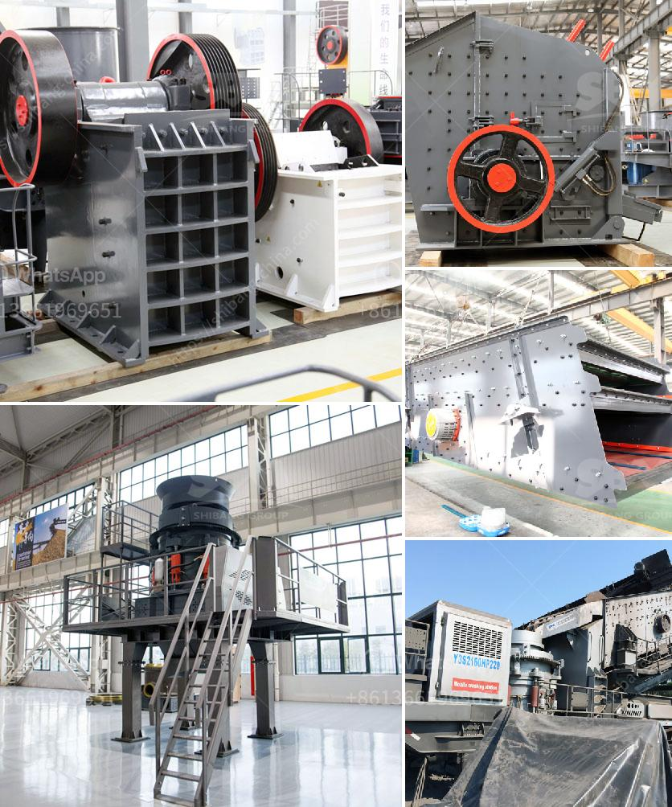

<h3>stone crushing machines in italy</h3>
Stone crushing machines in Italy have a long history and tradition in mining industry. Being well recognized all over the world, Italy stands out in stone crushing sector. With cutting-edge technology and an expert team of engineers, Italy produces machines that are regarded as the most reliable and efficient in the market.

The stone crushing machines in Italy are developed for crushing stones into small particles for building aggregates production and crushed materials for infrastructure construction. In Italy, there are many stone crushing machines manufacturers who provide crushing machines for the mining industry. Cone crushers are the choice for use in medium-hard to hard and abrasive natural stone as well as for raw material preparation in mining applications. These machines are a valuable asset to the industries as they are able to process the hardest rocks with high precision and accuracy.

The stone crushing machines in Italy are equipped with advanced technology that can easily crush the hard stones and ores into smaller dimensions. They are designed to overcome the challenges faced by the mining and construction industries. In Italy, the stone crushing industry can be seen as a considerable contributor to the economic growth and development of the country.

Stone crushing machines in Italy are widely used in mining, smelting, building materials, highways, railways, water conservancy, chemical industry and many other departments. The development prospects of the stone crushing machines in Italy are bright and considerable, and there are many successful cases to demonstrate the great potential.

In conclusion, stone crushing machines in Italy have the potential to provide valuable benefits to the mining industry and deliver reliable performance in demanding environments. The Italian stone crushing machines offer high crushing capacity, versatility, efficiency, and low operating costs. Additionally, they have a long lifespan and require minimal maintenance. With superior quality and exceptional performance, the stone crushing machines in Italy are an excellent investment for any business involved in mining or construction.
<h3>Contact us</h3><ul><li><strong>Whatsapp:&nbsp;<a href="https://wa.me/8613661969651">+8613661969651</a></strong></li><li><a href="https://swt.shibang-china.com/?git&amp;zhl&amp;stone crushing machines in italy"><strong>Online Service(chat now)</strong></a></li></ul><h3>Related</h3><ul><li><a href='quarrying crusher machines.md'>quarrying crusher machines</a></li><li><a href='equipment equipments used in gravel crushing.md'>equipment equipments used in gravel crushing</a></li><li><a href='700t h mobile crusher.md'>700t h mobile crusher</a></li><li><a href='mobile coal cone crusher for hire malaysia.md'>mobile coal cone crusher for hire malaysia</a></li><li><a href='jaw crusher terminator.md'>jaw crusher terminator</a></li></ul>