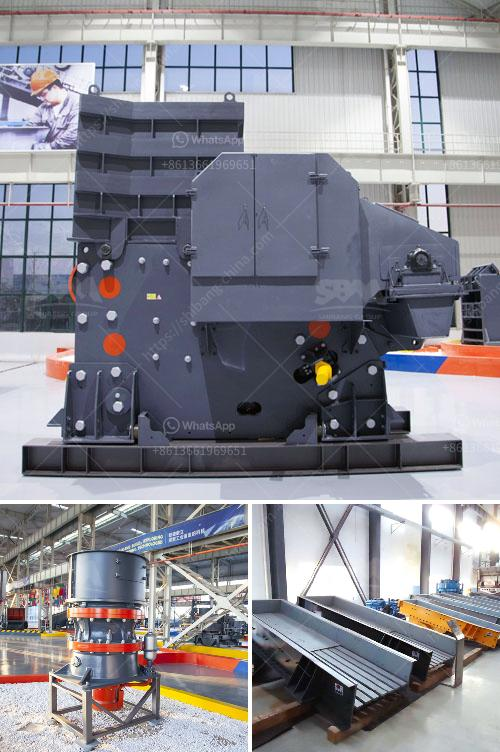

<h3>stone crushing plant germany</h3>
Germany, a vibrant land of diverse culture, pioneering technology, and scenic beauty, has introduced a stone crushing plant in the heart of its capital city, Berlin. The crushing plant promises to provide efficient and reliable service for construction materials processing, ensuring utmost customer satisfaction.

Situated on the outskirts of Berlin, this facility encompasses a large area and houses state-of-the-art equipment for stone crushing. The plant comprises various crushing machines, each capable of crushing different sizes of stones, rocks, and minerals. This diversity enables the plant to cater to a wide range of construction projects, meeting the varying requirements of contractors and builders.

One of the key features of this crushing plant is its high production capacity. Equipped with advanced machines, it can process a significant amount of materials per hour, ensuring a steady supply for construction sites. This ensures that projects are not hindered due to the scarcity of construction materials, ultimately promoting the timely completion of projects.

Furthermore, this stone crushing plant is equipped with cutting-edge technology that guarantees environmental friendliness. Various measures have been taken to minimize pollution and noise levels, making it an eco-friendly choice for individuals and businesses alike. The plant adheres to strict regulations and employs sustainable practices, ensuring minimal environmental impact.

The stone crushing plant also serves as an employment generator as it creates numerous job opportunities for the local community. Skilled workers are hired to operate the machinery, thereby stimulating the local economy and fostering growth in the region.

Overall, the stone crushing plant in Germany is a noteworthy undertaking that promises to contribute significantly to the construction industry's needs. With its highly efficient machinery and advanced technology, it ensures reliable production of construction materials while minimizing environmental impact. This investment not only benefits the construction sector but also the local community by providing employment opportunities and stimulating economic growth.
<h3>Contact us</h3><ul><li><strong>Whatsapp:&nbsp;<a href="https://wa.me/8613661969651">+8613661969651</a></strong></li><li><a href="https://swt.shibang-china.com/?git&amp;zhl&amp;stone crushing plant germany"><strong>Online Service(chat now)</strong></a></li></ul><h3>Related</h3><ul><li><a href='stone crushing equipment available.md'>stone crushing equipment available</a></li><li><a href='grinding and milling machines.md'>grinding and milling machines</a></li><li><a href='ultra fine powder grinding machine.md'>ultra fine powder grinding machine</a></li><li><a href='renta de cribas vibratorias en mexico.md'>renta de cribas vibratorias en mexico</a></li><li><a href='stone crusher plant design pdf.md'>stone crusher plant design pdf</a></li></ul>