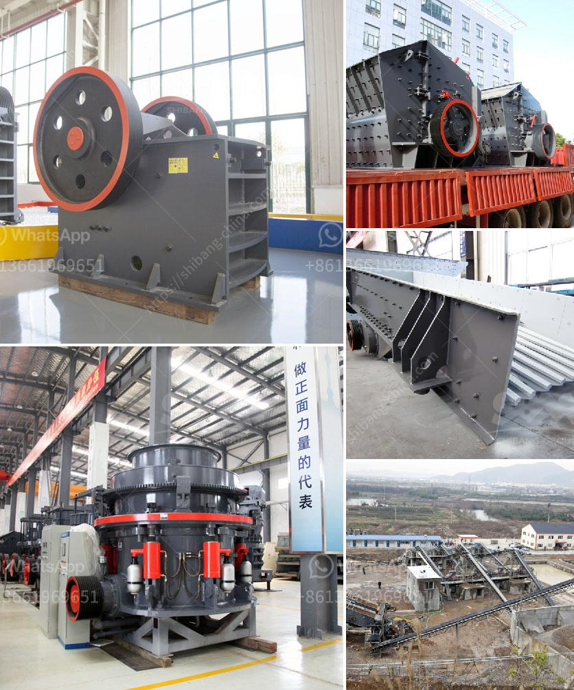

<h3>stone crushing prices</h3>
Stone crushing industry is an important industrial sector in many countries, engaged in producing crushed stone of various sizes depending upon the requirement which acts as raw material for various construction activities such as construction of roads, highways, bridges, buildings, canals etc. It is estimated that there are over 12,000 stone crusher units in India. The number is expected to grow further keeping in view the future plans for development of infrastructure of roads, canals and buildings that are required for overall development of the country.

In India, the Stone Crushing Industry sector is estimated to have an annual turnover of around Rs. 5000 crore (equivalent to over US$ 1 billion) and is therefore an economically important sector. The sector is estimated to be providing direct employment to over 500,000 people engaged in various activities such as mining, crushing plant, transportation of mined stones and crushed products etc.

Most of these personnel are from rural and economically backward areas where employment opportunities are limited and therefore it carries greater significance in terms of social importance in rural areas. It is a source of earning for uneducated poor unskilled rural people.

Stone crushing prices vary widely depending on the type and size of the machine used in the process. Many companies are investing in stone crushing equipment to increase their productivity and operational efficiency. Furthermore, the government initiatives such as the "Pradhan Mantri Awas Yojana" and the "Swachh Bharat Abhiyan" have fueled the demand for construction materials, including crushed stones.

Crushed stone is segregated into various sizes like 35mm, 20mm, 12mm, etc. for different uses. Crushed stone aggregates are used for construction of roads, bridges, housing, industrial building construction and other cement-based products. The growing construction activities in the country and the lack of availability of natural sand has led to a surge in the demand for crushed stones.

Moreover, the increasing prices of river-sand due to its non-availability, have led to the rise in the use of manufactured sand which is obtained from crushing of stones. Stone crushing prices have seen a significant rise over the past decade due to the increasing demand from the construction industry and the scarcity of natural resources. As a result, manufacturers and suppliers are continuously focusing on improving efficiency and reducing the overall cost of production to remain competitive in the market.

1. Type of stone crusher machine: Cone crushers, jaw crushers, and impact crushers are different types of crushers available in the market. The cost of each type varies based on the features and equipment involved in the process.

2. Size of the machine: Different size crushers are available in the market. The size determines the cost of the machine.

3. Capacity: The production capacity of the machine determines the cost. Higher capacity machines can crush more stone and handle larger quantities at a faster rate.

4. Location: The proximity of the machine to the source of raw material and the market significantly affects the transportation cost.

5. Maintenance and operating costs: Regular maintenance and repair costs for the machine should also be considered while calculating the overall cost.

In conclusion, the stone crushing industry plays a vital role in the construction industry. The increasing demand for crushed stones and the rising prices of natural sand have led to the growth of this industry. Manufacturers and suppliers are continuously striving to improve efficiency and reduce costs to remain competitive in the market. As the demand for construction material continues to rise, the prices of stone crushing equipment are expected to grow in the coming years.
<h3>Contact us</h3><ul><li><strong>Whatsapp:&nbsp;<a href="https://wa.me/8613661969651">+8613661969651</a></strong></li><li><a href="https://swt.shibang-china.com/?git&amp;zhl&amp;stone crushing prices"><strong>Online Service(chat now)</strong></a></li></ul><h3>Related</h3><ul><li><a href='rock sand plant feasibility report.md'>rock sand plant feasibility report</a></li><li><a href='talcum powder mill manufacturing.md'>talcum powder mill manufacturing</a></li><li><a href='barite processing plant feasibility study.md'>barite processing plant feasibility study</a></li><li><a href='gypsum beneficiation plant.md'>gypsum beneficiation plant</a></li><li><a href='carbon black processing plant.md'>carbon black processing plant</a></li></ul>