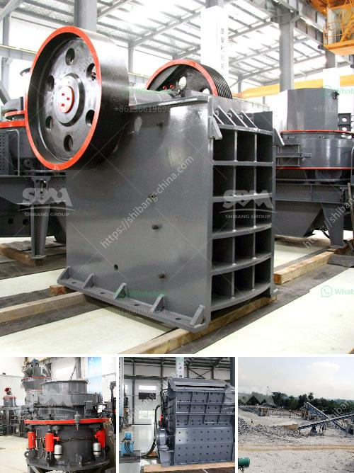

<h3>stone crushing production line zenith</h3>
Stone crushing production line is an important technological breakthrough in the field of stone crushing with the depletion of natural resources and the local market demand for gravel products, the crushing industry is booming. In recent years, as the state attaches more importance to the development of infrastructure construction, the demand for sand and gravel aggregate is increasing day by day, which has led to the rapid development of stone crushing production line.

Zenith, as a professional mining machinery manufacturer with over 30 years of experience, has devoted themselves to the R&D and manufacturing of crushing equipment. With a strong technical team and advanced crushing technology, Zenith provides comprehensive services for our customers' stone crushing production line.

The stone crushing production line produced by Zenith can be widely used in various ore crushing operations such as limestone, granite, basalt, pebble, and perlite. It adopts advanced design concepts and uses high-quality wear-resistant materials to prolong the service life of the crushing equipment, achieve high efficiency, and low energy consumption. The production line consists of vibrating feeder, jaw crusher, impact crusher, vibrating screen, belt conveyor, centralized electronic control, etc. Its output varies from 50 tons to 800 tons per hour, which can meet the different needs of customers.

The stone crushing production line is highly automated and requires less manual operation. The entire production process is dust-free and environmentally friendly, reducing pollution and saving energy. The advanced production technology and equipment ensure the product's quality and stability. Moreover, the production line is equipped with a variety of auxiliary equipment, such as dust removal equipment, noise reduction equipment, and intelligent control systems, to ensure the safety and stability of the production process.

Zenith's stone crushing production line has been sold to many countries and regions, such as Southeast Asia, Eastern Europe, South America, Middle East Africa, etc., and has won the trust and praise of customers. The complete pre-sales, sales, and after-sales service system can provide customers with comprehensive technical support and guidance, as well as professional installation and commissioning services. Zenith's efficient and reliable stone crushing production line has become the preferred choice for many customers in the mining industry.

In summary, Zenith's stone crushing production line is a cost-effective and high-quality solution for the production of gravel aggregates. The advanced technology and equipment ensure the efficient and stable operation of the entire production line. With Zenith's support, customers can achieve greater benefits and create a win-win situation. If you are looking for a reliable and trustworthy partner in the stone crushing industry, Zenith is your best choice.
<h3>Contact us</h3><ul><li><strong>Whatsapp:&nbsp;<a href="https://wa.me/8613661969651">+8613661969651</a></strong></li><li><a href="https://swt.shibang-china.com/?git&amp;zhl&amp;stone crushing production line zenith"><strong>Online Service(chat now)</strong></a></li></ul><h3>Related</h3><ul><li><a href='how to setup a stone quarry.md'>how to setup a stone quarry</a></li><li><a href='turkey cement mill plant for sale.md'>turkey cement mill plant for sale</a></li><li><a href='ball mill in mining.md'>ball mill in mining</a></li><li><a href='prices of cement clinker grinding unit in india.md'>prices of cement clinker grinding unit in india</a></li><li><a href='iron ore crushed machine second hand.md'>iron ore crushed machine second hand</a></li></ul>