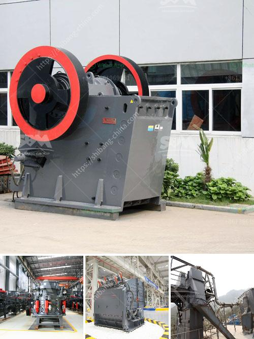

<h3>stone crushing quarry works with conveyor belt</h3>
Stone crushing quarry works with conveyor belt is an industry-focused website dedicated to providing information and resources about stone crushing quarries. In recent years, due to the continuous progress of the society, the demand for stone aggregates has been increasing. Quarries have been developed all over the world, and many different materials such as limestone, granite, and slag have been used and processed.

The stone quarrying industry has been highl+y developed for centuries. The quarrying of natural stone is an art form that cannot be replicated by machines. There is an age-old tradition of using the most unique and natural stones in the construction industry. Stone crushing quarries work with conveyor belts to transport the stones or rocks to the processing plant. The conveyor belts act as a bridge between the processing plant and the quarry. Places that are more prone to earthquakes or volcanic eruptions can use conveyor belts to transport stones and reduce the risk of damage caused by shaking or eruption.

Stone crushing quarry works with conveyor belt allow the users to transfer crushed stones of various sizes and shapes. The stones are loaded onto a conveyor belt and lifted up to the processing plant. These plants perform the crushing and screening operations, ensuring the final product is of high quality and meets specific requirements of the construction industry.

Conveyor belts are an integral part of the crushing quarry work and are heavily relied upon. The infrastructure and equipment needed for the quarry to function is extensive. To maintain a safe and efficient work environment, all the equipment must be well-designed, durable, and reliable. Conveyor belts are at the forefront of the crushing quarry's operation. They transport vast amounts of stone from the quarry to the processing plant, where it is turned into the desired product.

These conveyor belts are carefully designed and manufactured to withstand the harsh conditions of the quarry and to handle the demands of heavy-duty work. They are made of strong materials that can withstand the weight and pressure of the stones being transported. The belts are reinforced with multiple layers, ensuring they can handle the constant friction and pressure they endure.

Furthermore, conveyor belts are designed with safety in mind. They are equipped with safety features such as emergency stop buttons and speed control systems to prevent accidents and ensure the well-being of workers. Conveyor belts are also easy to operate and require minimal maintenance, reducing downtime and increasing productivity.

In conclusion, stone crushing quarries work with conveyor belts to transport and process stones into finished products. The conveyor belts are vital to ensure the efficient operation of the quarry and the processing plant, as a whole. With the advances in technology, conveyor belts are becoming more versatile, allowing quarry owners to explore different materials and enhance their production capabilities. As the demand for stone aggregates continues to grow, conveyor belts will play an essential role in meeting the needs of the construction industry and providing the materials necessary for infrastructure development.
<h3>Contact us</h3><ul><li><strong>Whatsapp:&nbsp;<a href="https://wa.me/8613661969651">+8613661969651</a></strong></li><li><a href="https://swt.shibang-china.com/?git&amp;zhl&amp;stone crushing quarry works with conveyor belt"><strong>Online Service(chat now)</strong></a></li></ul><h3>Related</h3><ul><li><a href='silica sand crusher price in india.md'>silica sand crusher price in india</a></li><li><a href='gravel jaw crusher.md'>gravel jaw crusher</a></li><li><a href='conveyor belt machine.md'>conveyor belt machine</a></li><li><a href='cost of cement plant.md'>cost of cement plant</a></li><li><a href='chromite processing plant and separation machine.md'>chromite processing plant and separation machine</a></li></ul>