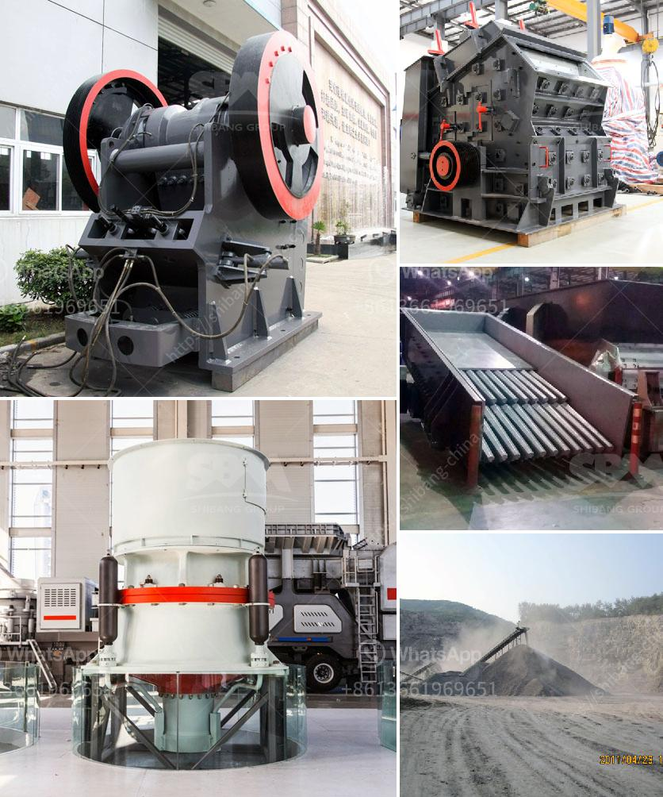

<h3>stone grinding mill</h3>
Stone grinding mill is a versatile and efficient tool for grinding various materials into fine powder. It can easily grind limestone, calcite, dolomite, marble, talc, gypsum, and other mineral powders. With a hardness below 7 and moisture content below 6%, the grinding mill can grind different sizes of stones into a powder-like substance.

The stone grinding mill uses a combination of abrasive grinding media to grind the material. The mill consists of a rotating shaft with sturdy hammers attached. These hammers strike and grind the material until it reaches the desired fineness. The grindstones inside the mill also help in crushing and grinding the material.

One of the main advantages of using a stone grinding mill is its ability to produce fine and uniform particles. Unlike other grinding methods, such as ball mills or hammer mills, the stone grinding mill ensures that the powder particles are of a consistent size. This makes it ideal for applications where a precise particle size distribution is required, such as in the production of ceramic tiles or paints.

Another advantage of the stone grinding mill is its durability. The high-quality materials used in its construction ensure that it can withstand years of heavy use without wearing out. This makes it a cost-effective investment for businesses that require a reliable and efficient grinding solution.

Stone grinding mills are also environmentally friendly as they do not require any additional chemicals for the grinding process. The natural grinding stones are made from sustainable materials and do not create any pollution or waste.

In conclusion, stone grinding mills are a versatile and efficient tool for grinding various materials into fine powder. They offer precise particle size distribution, durability, and environmentally friendly operation. Whether used in construction, ceramics, or other industries, stone grinding mills provide a reliable and cost-effective grinding solution.
<h3>Contact us</h3><ul><li><strong>Whatsapp:&nbsp;<a href="https://wa.me/8613661969651">+8613661969651</a></strong></li><li><a href="https://swt.shibang-china.com/?git&amp;zhl&amp;stone grinding mill"><strong>Online Service(chat now)</strong></a></li></ul><h3>Related</h3><ul><li><a href='sand making machine crusher.md'>sand making machine crusher</a></li><li><a href='pulverizing ball mills suppliers.md'>pulverizing ball mills suppliers</a></li><li><a href='machinery for bentonite crusher production.md'>machinery for bentonite crusher production</a></li><li><a href='station de concasassage theniet elhad.md'>station de concasassage theniet elhad</a></li><li><a href='hammer crusher german made.md'>hammer crusher german made</a></li></ul>