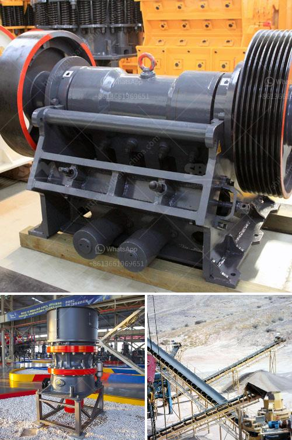

<h3>stone powder making machine in india</h3>
Stone powder making machine, also known as stone milling machine, stone grinding machine, powder making machine, is a machine that can grind various kinds of materials into powder. The stone powder making machine is widely used in industries such as mining, metallurgy, building materials, chemicals, and so on. It is mainly for the grinding of materials with hardness less than 6 in Moh's scale and humidity less than 6 percent.

India is a country with abundant resources of stone. In recent years, with the continuous improvement of the infrastructure construction, India has the increasing demand for stone powder. As a result, the stone powder making machine market is booming in India.

Main types of stone powder making machines in India include the Raymond mill, micro powder grinding mill, superfine powder grinding mill, stone grinder machine, vertical roller mill, hammer mill, etc. According to the different application of each stone powder making machine, the production capacity and processing materials of the machine are different.

The Raymond mill is one of the traditional stone powder grinding machines. It has a strong ability to process stone powder with a fineness of 50-500 mesh. The final powder can be adjusted freely between 80-325 mesh. The Raymond mill is also called Raymond roller mill or Raymond grinding mill, which is widely used in mining, chemical, construction, and other industries.

The micro powder grinding mill is suitable for processing different ore materials. It can be used for fine grinding of non-flammable and explosive materials with humidity less than 6 percent, such as feldspar, calcite, limestone, talc, barite, dolomite, marble, gypsum, etc. The final powder fineness can be adjusted between 300-3000 mesh.

The superfine powder grinding mill is a new type of grinding equipment designed by Clirik Machinery Co., Ltd. It is used for processing non-metallic ore with Moh's hardness less than 6 and humidity less than 6 percent. It has a wide range of applications, including cement, fluorite, talc, calcium carbonate, quartz, feldspar, bentonite, etc. The final powder fineness can be adjusted between 300-3000 mesh.

In addition to these types of stone powder making machines, there are also stone grinding mills, stone grinder machines, vertical roller mills, hammer mills, etc., which are widely used in various industries.

The stone powder making machine has the advantages of high efficiency, low energy consumption, small footprint, easy operation, etc. It can grind various kinds of materials into powder, which is an essential equipment in the stone powder production line. In India, the stone powder making machine is widely used in many industries such as mining, metallurgy, chemical engineering, etc.

In conclusion, with the continuous development of the infrastructure construction in India, the demand for stone powder is increasing, which promotes the development of the stone powder making machine market. Various types of stone powder making machines are available in India, and each type has its own advantages and characteristics. When choosing a stone powder making machine, customers should consider their own needs and choose a suitable machine to achieve efficient production.
<h3>Contact us</h3><ul><li><strong>Whatsapp:&nbsp;<a href="https://wa.me/8613661969651">+8613661969651</a></strong></li><li><a href="https://swt.shibang-china.com/?git&amp;zhl&amp;stone powder making machine in india"><strong>Online Service(chat now)</strong></a></li></ul><h3>Related</h3><ul><li><a href='calcium carbide plant and machinery.md'>calcium carbide plant and machinery</a></li><li><a href='new technology ball mill factories europe.md'>new technology ball mill factories europe</a></li><li><a href='jaw crusher seller in philippines pakistan.md'>jaw crusher seller in philippines pakistan</a></li><li><a href='crushing plant in lahore.md'>crushing plant in lahore</a></li><li><a href='gold ore processing equipment manufacturer.md'>gold ore processing equipment manufacturer</a></li></ul>