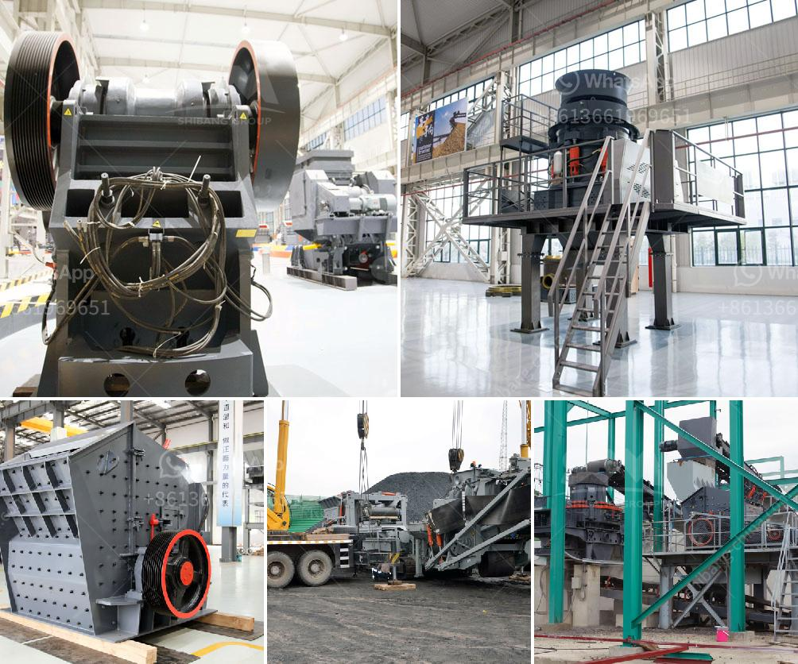

<h3>stone powder raymond machine price</h3>
Stone powder Raymond machine is a common grinding equipment in mining machinery. It is mainly used for barite, calcite, potassium feldspar, talc, marble, limestone, dolomite, fluorite, lime, activated clay, activated carbon, bentonite, kaolin, cement, phosphate rock, gypsum, glass, insulation materials and other non-flammable and explosive mineral, chemical, construction and other industries with Mohs hardness not greater than 7 and humidity below 6%.

The stone powder Raymond machine has a variety of models and complete functions, providing customers with a wide range of grinding processes. The fineness of the finished product can be adjusted from 100 mesh to 325 mesh according to requirements. It has the advantages of high efficiency, low energy consumption, small floor space, and small investment cost.

The price of stone powder Raymond machine is determined by factors such as the model, size, and configuration of the equipment. As a professional manufacturer of grinding equipment, Fote Machinery has rich experience in grinding production and can provide customized service according to customer requirements.

Compared with other grinding equipment, the stone powder Raymond machine has the following advantages:

1. High grinding efficiency: The use of advanced grinding technology and high-pressure spring device can improve the grinding efficiency by 20-30%.

2. Wide range of applications: It can be used for grinding various materials with a hardness of less than 7 and a humidity of less than 6%.

3. Stable operation: The main mill transmission device adopts sealed gear box and belt wheel, with smooth transmission and reliable operation.

4. Environmental protection: The whole system adopts full negative pressure production, no dust overflow, and the environment is clean and tidy.

In conclusion, the stone powder Raymond machine is a cost-effective and valuable grinding equipment. Its price is reasonable and competitive in the market. Customers can choose the appropriate model according to their actual needs and budget. With the continuous advancement of grinding technology, the stone powder Raymond machine will bring more convenience and benefits to grinding production.
<h3>Contact us</h3><ul><li><strong>Whatsapp:&nbsp;<a href="https://wa.me/8613661969651">+8613661969651</a></strong></li><li><a href="https://swt.shibang-china.com/?git&amp;zhl&amp;stone powder raymond machine price"><strong>Online Service(chat now)</strong></a></li></ul><h3>Related</h3><ul><li><a href='silicon ore processing equipment.md'>silicon ore processing equipment</a></li><li><a href='gold hammer mill used forr sale in zimbabwe.md'>gold hammer mill used forr sale in zimbabwe</a></li><li><a href='crusher stone prices peru.md'>crusher stone prices peru</a></li><li><a href='jaw crusher for sale in philippines.md'>jaw crusher for sale in philippines</a></li><li><a href='grinding mill for limestone.md'>grinding mill for limestone</a></li></ul>