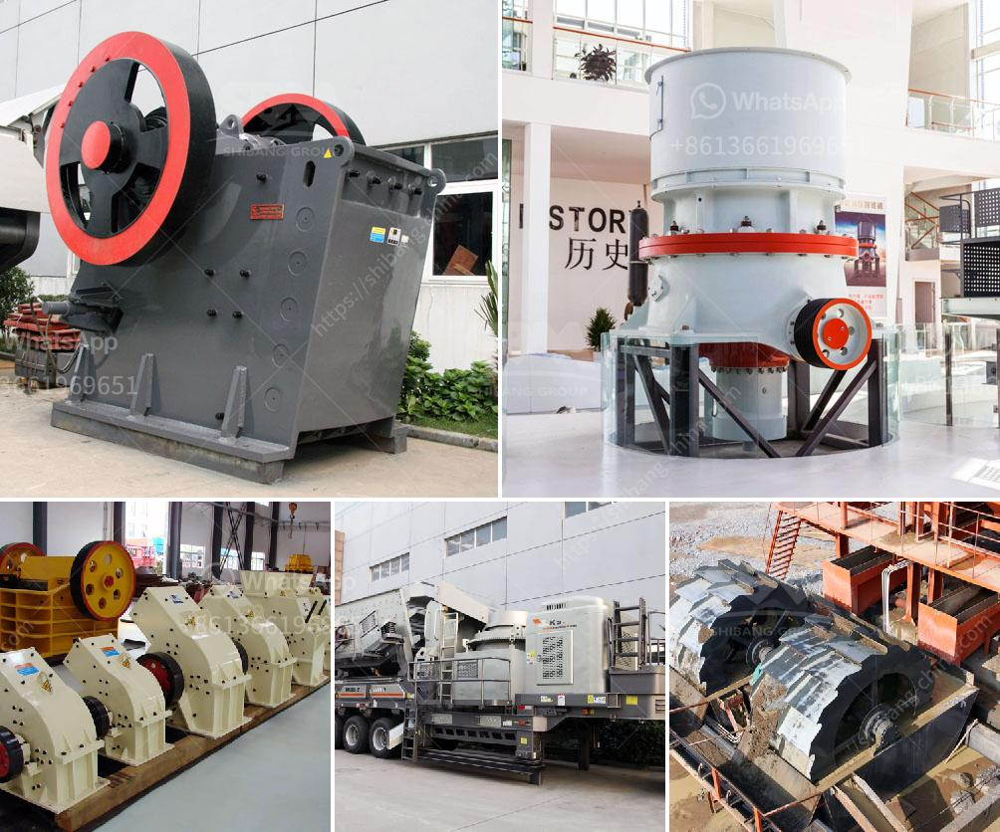

<h3>stone quarries south africa</h3>
Stone quarries, also known as stone mines, are essential resources in all fields of construction, be it residential, commercial, or industrial. These quarries are a vital part of South Africa's economy, providing employment opportunities for thousands of people in a range of industries. However, the devastation caused by improper and illegal stone mining operations cannot be understated. This article aims to shed light on stone quarries in South Africa, both the benefits they offer and the challenges they pose.

South Africa is blessed with an abundance of natural resources, including an array of minerals that can be found beneath its soils. Stones such as granite, limestone, slate, and sandstone are quarried throughout the country for various purposes, from building materials to decorative elements. The stone industry in South Africa employs over 30,000 workers, contributing significantly to the nation's Gross Domestic Product (GDP). These quarries not only create jobs but also cater to the growing demand for infrastructure development, both locally and internationally.

One of the primary uses of stone from South African quarries is in the construction sector. Stones, especially granite and limestone, are favored for their durability and aesthetic appeal. These stones are used to build roads, bridges, and buildings, adding to the nation's infrastructure. Additionally, they are also processed into smaller pieces like tiles, countertops, and pavers, serving the needs of the interior design industry.

Apart from construction, stones extracted from South African quarries are often desired for their natural beauty. The distinct colors and patterns found in these stones make them popular choices for home and garden decor. From ornate statues and fountains to polished slabs used in landscaping, South African stones have found a global market, contributing to the nation's export revenues and international reputation.

Despite the economic benefits, the stone quarrying industry in South Africa faces certain challenges. The rapid expansion of urban areas has led to an increase in demand for construction materials, causing some companies to exploit quarries in unsustainable ways. Illegal stone mining operations are prevalent in some regions, causing damage to the environment and endangering workers' lives. These operations often disregard safety regulations, resulting in accidents and even fatalities.

Environmental concerns associated with stone quarries include deforestation, soil erosion, and water contamination. Trees and vegetation are often cleared to access the stone deposits underground, leading to permanent habitat destruction. The process of extracting stones can also lead to erosion, as heavy machinery disrupts the natural topography. Furthermore, the chemicals used during stone processing, such as cutting and polishing, can contaminate nearby water sources if proper systems are not in place.

To mitigate these challenges, the South African government, along with industry stakeholders, has implemented regulations to control mining activities and promote sustainable practices. These regulations aim to ensure worker safety, minimize environmental impact, and encourage responsible quarrying. Compliance with these regulations requires companies to obtain permits, adhere to strict mining plans, and provide rehabilitation plans for disturbed areas.

In conclusion, stone quarries in South Africa play an essential role in the nation's infrastructure development, job creation, and export revenue generation. However, these benefits must be balanced with the need for sustainable and responsible quarrying practices. By enforcing regulations and promoting environmentally friendly approaches, the stone quarrying industry can continue to be a valuable contributor to South Africa's economy without compromising the environment and people's well-being.
<h3>Contact us</h3><ul><li><strong>Whatsapp:&nbsp;<a href="https://wa.me/8613661969651">+8613661969651</a></strong></li><li><a href="https://swt.shibang-china.com/?git&amp;zhl&amp;stone quarries south africa"><strong>Online Service(chat now)</strong></a></li></ul><h3>Related</h3><ul><li><a href='mica crusher production plants.md'>mica crusher production plants</a></li><li><a href='buy stone crusher.md'>buy stone crusher</a></li><li><a href='stone grinding mill.md'>stone grinding mill</a></li><li><a href='gravel jaw crusher.md'>gravel jaw crusher</a></li><li><a href='copper processing equipment.md'>copper processing equipment</a></li></ul>