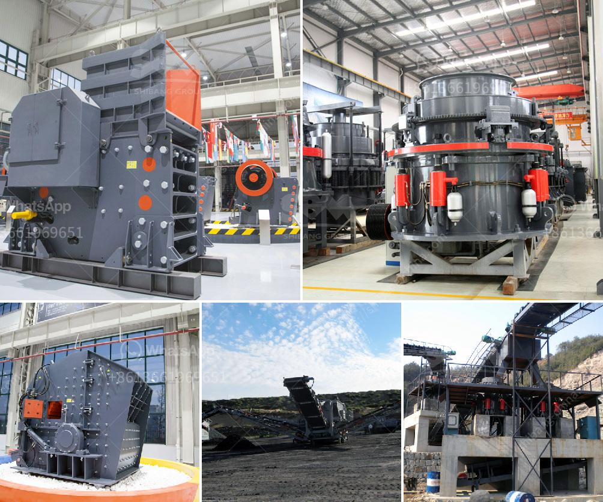

<h3>stone quarry crusher machines</h3>
Stone quarry crusher machines are widely used in mining, smelting, building materials, roads, railways, water and chemical industries and other departments. Ore crushing and processing of crushing equipment: Cone crusher, Jaw crusher, Impact crusher, Hammer crusher, Roller crusher, etc.

Category crushing equipment can be roughly divided into two categories according to its crushing principle and structure characteristics: Crusher equipment refers to the various types of Stone Quarries Crushers in the building materials industry, such as jaw crushers, impact crushers, hammer crushers, roller crushers, and cone crushers. Stone Quarry Crushers are mainly selected through material capacity and required finished products. In the mining industry, the Quarry Crusher machines can be classified into four stages: primary crusher, secondary crusher, tertiary crusher, and quaternary crusher.

The Primary Crusher: jaw crusher is used to break down Quarry Stone into a smaller size. The Primary Crusher is typically a jaw crusher or gyratory crusher, depending on the capacity requirement. Jaw crushers are the most commonly used in primary crushing stages due to their high reduction ratio and large feed opening.

The Secondary Crusher: secondary crusher is typically cone crusher or impact crusher. Cone crushers use a spinning cone that gyrates in the bowl in an eccentric motion to crush the rock between the cone surface, called the mantle, and the crusher bowl liner. Impact crushers are used to crush materials that are not too abrasive and are good at breaking materials with a compressive strength up to 350 MPa.

The Tertiary Crusher: tertiary crusher fine rock crusher is also known as sand and stone factory. It consists mainly of impact plates, plate hammers and counterattack plate brackets. The crusher mainly relies on impact energy to complete the crushing material operation and has the advantages of simple structure, convenient operation, and maintenance. It is suitable for crushing limestone, gypsum, granite, Coke and other medium hardness materials for medium and fine crushing.

The Quaternary Crusher: quaternary crusher is a vertical impact crusher used to crush materials of an incoming size of 4-15mm for the production of washed and unwashed rock sand of size 0-4mm and 0-2mm. The impact Crusher machines will be of high efficiency and low operating costs. In order to achieve the required particle size, brands of quarry crusher machines are many when mining investors choose the rock crusher machines, due to the various types, price difference, acceptable to purchase the needed crushing equipment.

The Stone Quarry Crushers’ material crushing and processing requirements can also be customized according to the user's specifications for screening, sorting, and quarantining changes. The maximum use of stemization technology, make the crusher to maximize the utilization of energy, improve the capacity and crushing efficiency. Quarry crushing production line configuration is mainly based on customer specifications and production of stone and stone use to make sure that we provide pre-sale, sale and comprehensive services, based on customer production site to the configuration process, we provide pre-sale, sale and comprehensive service incorporating the latest technology and efficient, reliable quality of equipment is the first choice of investment in quarry enterprises.
<h3>Contact us</h3><ul><li><strong>Whatsapp:&nbsp;<a href="https://wa.me/8613661969651">+8613661969651</a></strong></li><li><a href="https://swt.shibang-china.com/?git&amp;zhl&amp;stone quarry crusher machines"><strong>Online Service(chat now)</strong></a></li></ul><h3>Related</h3><ul><li><a href='quartz powder mining mill.md'>quartz powder mining mill</a></li><li><a href='track mounted crushers.md'>track mounted crushers</a></li><li><a href='latest stone crusher machine price india.md'>latest stone crusher machine price india</a></li><li><a href='pioneer ve rock crusher.md'>pioneer ve rock crusher</a></li><li><a href='cement unit cost for 150 tons.md'>cement unit cost for 150 tons</a></li></ul>