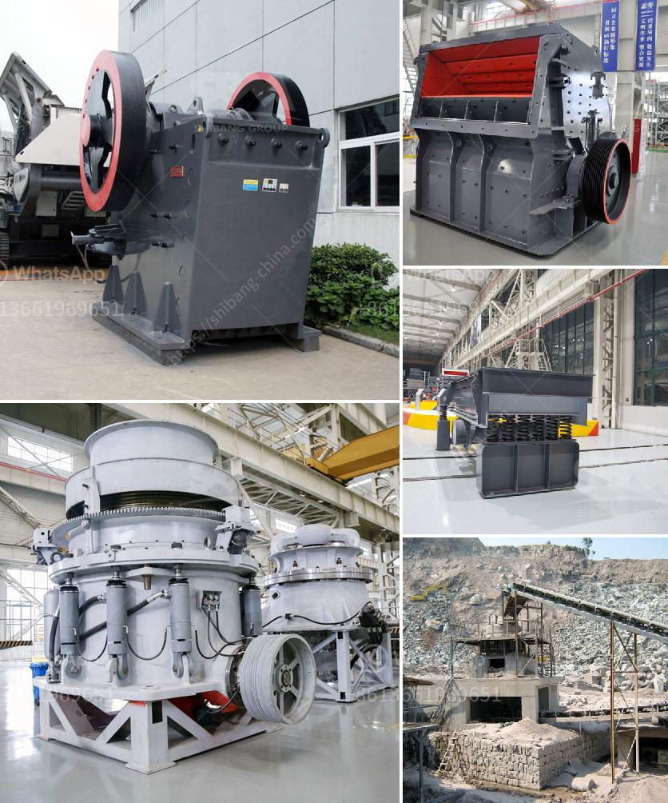

<h3>stone quarry equipment price in ethiopia</h3>
Stone quarrying has been a key extractive economic activity in Ethiopia for centuries. Its expansion was accelerated when the country experienced a construction boom in the late 20th century. The demand for building materials such as stones and gravels has significantly increased, leading to an upsurge in the production of stone quarry equipment.

Ethiopia, a landlocked country in the Horn of Africa, is endowed with abundant mineral resources. These resources include limestone, marble, granite, and sandstone quarries, which are spread throughout the country. These stone quarries extract large stones and deliver them to the construction sites across the nation.

The price of stone quarry equipment is influenced by several factors. First, the type of stone quarry equipment has a direct impact on its price. For instance, a jaw crusher has a lower price compared to a cone crusher. Additionally, higher operational cost is involved for a vibrating screen compared to a trommel screen. The equipment selection process also affects the overall cost of the equipment. The choice of equipment should be based on location, scale, and nature of the project being undertaken.

Apart from the type of equipment, another factor that influences the equipment price is the availability of spare parts. Some stone quarry equipment might be manufactured overseas, making it challenging to find the required spare parts. This could result in delays and increased costs if a breakdown occurs. Therefore, it is essential to consider the availability of spare parts when purchasing stone quarry equipment.

Moreover, the cost of stone quarry equipment varies depending on its capacity. High capacity stone quarry equipment tends to be priced higher than low-capacity equipment. However, investing in high-capacity equipment can be worthwhile in the long run because it increases productivity and reduces production costs.

Furthermore, the stone quarry equipment price is also influenced by local market conditions. Economic factors, such as inflation, exchange rates, and taxation policies, can all impact the cost of equipment. Fluctuations in international markets, supply chain disruptions, and changes in government regulations can further affect the price of stone quarry equipment.

To obtain the best value for money, buyers should consider factors such as product quality, durability, and after-sales services when purchasing stone quarry equipment. It is crucial to ensure that the equipment meets international quality standards and is built to withstand the harsh operating conditions of a quarry. Additionally, reliable after-sales services and technical support are vital to ensure the smooth operation and long lifespan of the equipment.

In conclusion, the price of stone quarry equipment in Ethiopia varies based on the type, capacity, availability of spare parts, local market conditions, and other factors. Choosing the right equipment and supplier can greatly impact the overall cost of production and ensure the successful completion of construction projects. Therefore, buyers should carefully consider these aspects before making a purchase decision in order to obtain the best value for their investment.
<h3>Contact us</h3><ul><li><strong>Whatsapp:&nbsp;<a href="https://wa.me/8613661969651">+8613661969651</a></strong></li><li><a href="https://swt.shibang-china.com/?git&amp;zhl&amp;stone quarry equipment price in ethiopia"><strong>Online Service(chat now)</strong></a></li></ul><h3>Related</h3><ul><li><a href='crusher for pozzuolana.md'>crusher for pozzuolana</a></li><li><a href='gypsum chromium limestone mining.md'>gypsum chromium limestone mining</a></li><li><a href='how does a stone crushing plant work.md'>how does a stone crushing plant work</a></li><li><a href='pulverizing ball mills suppliers.md'>pulverizing ball mills suppliers</a></li><li><a href='dry ball mill in lima peru.md'>dry ball mill in lima peru</a></li></ul>