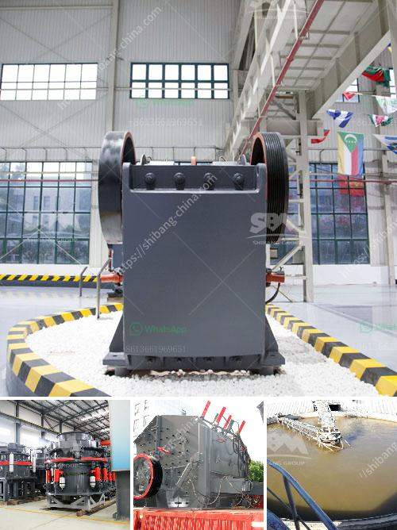

<h3>stone quarry machines in uganda for sale</h3>
Stone quarrying is a lucrative business in Uganda, providing millions of jobs and opportunities to local businessmen and women. With several stone quarrying sites spread across the country, it is easy to see why it has become a key economic activity. However, to effectively and efficiently extract these minerals, state-of-the-art machinery is essential.

Stone quarry machines are used to extract and process various materials, such as granite, limestone, gravel, and sand. These machines are capable of reducing large rocks into smaller pieces, after which they are used further for various construction purposes. These machines are installed at the quarries and help in breaking large chunks of stones into smaller aggregates for further processing or for sale.

In Uganda, there are numerous companies engaged in stone quarrying business, and several machines are available in the market for sale. These machines speed up the mining process, making it easier and more productive. The machines are primarily used for mining granite, limestone, marble, and other types of stones.

Various types of stone quarry machines have different functions, such as crushing machines that are used for reducing the size of larger stones, pulverizing machines as well as vibrating screeners, which help in separating crushed materials. These machines come in different sizes and capacities, depending on the needs of the quarry.

Additionally, technological advancements have led to the development of more efficient and productive stone quarry machines. Some machines are equipped with advanced features like computer-controlled operations, which further enhance the mining process. These machines are also designed with safety features that prioritize the well-being of the operators.

Investing in stone quarry machines in Uganda is a cost-effective option for businesses that want to improve their productivity and profitability. By using these machines, quarry owners can save on labor costs and extract more materials in a shorter period, thereby maximizing their profits.

In conclusion, stone quarry machines play a crucial role in Uganda's stone quarrying industry. Investing in these machines will result in increased productivity, reduced labor costs, and ultimately, higher profits. As the demand for construction materials continues to rise, stone quarry machines for sale in Uganda will remain highly desirable commodities for business-minded individuals.
<h3>Contact us</h3><ul><li><strong>Whatsapp:&nbsp;<a href="https://wa.me/8613661969651">+8613661969651</a></strong></li><li><a href="https://swt.shibang-china.com/?git&amp;zhl&amp;stone quarry machines in uganda for sale"><strong>Online Service(chat now)</strong></a></li></ul><h3>Related</h3><ul><li><a href='crusher primary cone crusher.md'>crusher primary cone crusher</a></li><li><a href='to buy a second hand mobile stone crusher plant india.md'>to buy a second hand mobile stone crusher plant india</a></li><li><a href='limestone quarry machines and equipments.md'>limestone quarry machines and equipments</a></li><li><a href='depreciacion de molino industrial.md'>depreciacion de molino industrial</a></li><li><a href='ball mill manufacture in chennai.md'>ball mill manufacture in chennai</a></li></ul>