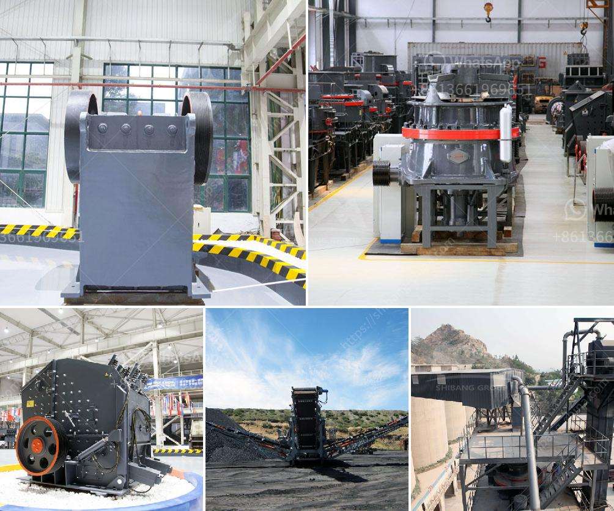

<h3>stone quarrying companies in tanzania</h3>
Stone quarrying is one of the key extractive industries in Tanzania and the East African region, accounting for millions of dollars in revenue annually. The industry plays a crucial role in the infrastructure development of any country. Tanzania, in particular, has witnessed an increase in the number of stone quarrying companies in recent years. With the demand for building materials skyrocketing, there has been a surge in the number of companies exploiting natural resources for profit.

Stone quarrying can have significant environmental impacts, such as deforestation, soil erosion, and contamination of water sources. However, it is crucial to recognize that some companies are implementing sustainable practices to mitigate these negative effects and ensure the long-term viability of the industry.

One such company that stands out is the Quarrying and Concrete Solutions (QUARCO) Ltd. Their approach is centered around sustainable business practices that prioritize the preservation of the environment while also meeting the market demand for quality construction materials. QUARCO effectively demonstrates that economic growth can harmoniously coexist with environmental responsibility.

To minimize the impact on the environment, QUARCO has adopted several critical sustainable measures. First, the company employs advanced quarrying techniques that minimize the disruption of natural habitats. Through careful planning and strategic extraction, they aim to limit the loss of biodiversity associated with stone quarrying activities.

QUARCO also prioritizes the rehabilitation of quarries once they are no longer in use. By re-verditing the quarries, the company returns the land to its natural state, promoting the regeneration of flora and fauna. This practice not only contributes to the conservation of ecosystems but also enhances the visual aesthetics of the surrounding areas.

Water management is another area where QUARCO excels. They have implemented comprehensive rainwater harvesting systems to reduce dependence on external water sources for their operations. Additionally, the company uses recycled water in various processes, minimizing freshwater consumption. By implementing these measures, QUARCO effectively reduces its environmental footprint, conserves natural resources, and maintains the hydrological balance.

QUARCO's commitment to social responsibility and community development is another significant aspect of their sustainability initiatives. The company actively engages with local communities, prioritizing employment, skills development, and capacity-building opportunities. By providing locals with jobs and access to training programs, QUARCO ensures that the economic benefits of stone quarrying are distributed equitably, leading to improved livelihoods and poverty reduction.

Furthermore, QUARCO is keen on promoting health and safety standards for its employees, investing in protective equipment, and training programs focused on hazard prevention. This commitment not only helps safeguard workers' well-being but also fosters a positive work environment that enhances productivity.

In conclusion, while stone quarrying can have detrimental effects on the environment, some companies in Tanzania are adopting sustainable business practices to ensure the long-term viability of the industry. Companies like QUARCO demonstrate that responsible quarrying is possible through measures such as habitat conservation, quarry rehabilitation, water management, and community engagement. By actively mitigating negative impacts, these companies emphasize the potential for economic growth and environmental preservation to coexist harmoniously.
<h3>Contact us</h3><ul><li><strong>Whatsapp:&nbsp;<a href="https://wa.me/8613661969651">+8613661969651</a></strong></li><li><a href="https://swt.shibang-china.com/?git&amp;zhl&amp;stone quarrying companies in tanzania"><strong>Online Service(chat now)</strong></a></li></ul><h3>Related</h3><ul><li><a href='jaw crushers in harare zimbabwe.md'>jaw crushers in harare zimbabwe</a></li><li><a href='small mining equipment price in south africa.md'>small mining equipment price in south africa</a></li><li><a href='cement plants in west bengal list.md'>cement plants in west bengal list</a></li><li><a href='portable concrete crusher for rent qatar.md'>portable concrete crusher for rent qatar</a></li><li><a href='technology of conveyor belts.md'>technology of conveyor belts</a></li></ul>