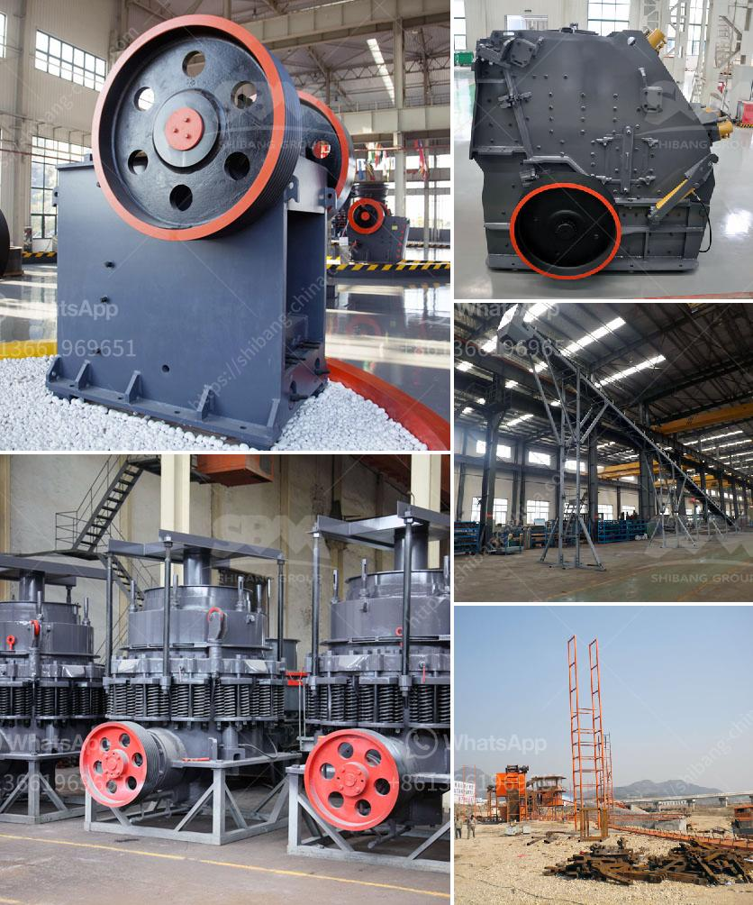

<h3>stone quarrying equipment</h3>
Stone quarrying is the process of extracting rocks and other materials from the earth's surface. These materials have been widely used in construction projects and landscaping designs due to their durability and strength. To efficiently extract these rocks, special equipment is required. Stone quarrying equipment is designed to provide the maximum productivity, safety, and efficiency in various quarrying applications.

The primary purpose of stone quarrying equipment is to drill holes in the ground, release explosive charges to break the rocks, and transport the stone into dump trucks or ground conveyors for further processing. Several types of machinery are commonly used in stone quarrying operations. Here are some of the most essential equipment:

1. Drilling machines: Drilling machines are used to create boreholes into the earth's surface. They use a rotating mechanism with various drill bits to penetrate the rocks. Drilling machines are crucial for quarrying operations as they determine the size and depth of the quarry.

2. Blasting equipment: Blasting is an essential step in the stone quarrying process. Explosives are used to break down the rocks into manageable sizes. Blasting equipment, such as explosives storage magazines, detonators, and blasting machines, ensure the safe and efficient use of explosives.

3. Crushers and screeners: Once the stone has been extracted from the quarry, it needs to be crushed into smaller sizes for further processing. Crushers and screeners are used for this purpose. Crushers break down the rocks into smaller pieces, while screeners separate the crushed stone into various sizes for different applications.

4. Loaders and haul trucks: Loaders and haul trucks are used to transport the extracted stone from the quarry to the processing plant or designated storage area. Loaders are equipped with buckets that scoop up the stone, while haul trucks carry the stone to the desired location. These machines are essential for ensuring the smooth operation and continuous supply of stones.

5. Water sprayers: Dust is a common issue in stone quarrying operations. To mitigate dust emissions and improve air quality, water sprayers are used. Water sprayers dampen the dust particles, preventing them from dispersing into the air. This not only improves the working environment but also minimizes the environmental impact of stone quarrying.

6. Safety equipment: Stone quarrying can be a hazardous occupation. To ensure the safety of the workers, appropriate safety equipment should be provided. This includes protective clothing, helmets, safety glasses, and respiratory protection to prevent dust inhalation.

In conclusion, stone quarrying equipment plays a crucial role in the extraction and processing of rocks and other materials for construction purposes. It provides the necessary machinery to efficiently drill, blast, crush, and transport the stones. Additionally, safety equipment ensures the well-being of the workers involved in quarrying operations. With the use of advanced technologies, stone quarrying equipment continues to evolve, making quarrying operations more productive, safer, and sustainable.
<h3>Contact us</h3><ul><li><strong>Whatsapp:&nbsp;<a href="https://wa.me/8613661969651">+8613661969651</a></strong></li><li><a href="https://swt.shibang-china.com/?git&amp;zhl&amp;stone quarrying equipment"><strong>Online Service(chat now)</strong></a></li></ul><h3>Related</h3><ul><li><a href='mobile dimension stone processing dressing cutting.md'>mobile dimension stone processing dressing cutting</a></li><li><a href='hammer crusher german made.md'>hammer crusher german made</a></li><li><a href='stone crusher with tractor.md'>stone crusher with tractor</a></li><li><a href='stone crushing and screening plant.md'>stone crushing and screening plant</a></li><li><a href='price of ballast crusher machine in kenya.md'>price of ballast crusher machine in kenya</a></li></ul>