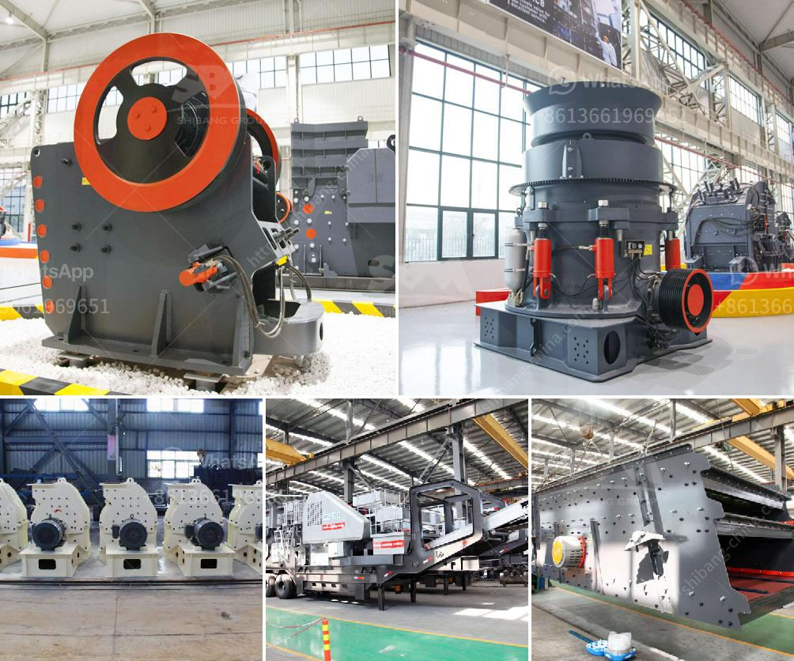

<h3>stone quarrying process</h3>
Stone quarrying is the process of extracting stones from the earth's surface in a stone quarry or pit. It typically involves the removal of overburden, which is the soil and rock that covers the mineral deposit, followed by the cutting and processing of the stone into usable shapes and sizes.

The first step in the stone quarrying process is the removal of overburden. This is done using heavy equipment such as bulldozers, excavators, and trucks. The soil, vegetation, and rocks covering the quarry site are cleared to expose the stone deposit beneath. This process ensures that the stone can be accessed and extracted efficiently.

Once the overburden has been removed, the next step is to extract the stone itself. This is typically done using techniques such as drilling and blasting. Holes are drilled into the rock face, and explosive charges are inserted. These charges are then detonated, fracturing the rock and allowing it to be loaded and transported.

After the stone has been extracted, it undergoes further processing to remove any impurities and shape it into usable forms. This can involve crushing the stone into smaller pieces, sorting it based on size and quality, and sometimes polishing or cutting it into specific shapes.

Finally, the processed stone is ready to be used for various purposes. It can be used as construction material for buildings, roads, and bridges. It can also be used in landscaping projects, such as paving stones or decorative rocks. The versatility of stone makes it a valuable resource that is in high demand in various industries.

However, it is important to note that stone quarrying can have environmental impacts. The removal of overburden and extraction of stone can disrupt ecosystems and habitats. It can also result in the generation of dust and noise pollution, as well as the production of waste materials.

To mitigate these impacts, quarrying operations often implement measures such as reclamation and rehabilitation plans. These plans aim to restore the site to its natural state once extraction is complete, and ensure the responsible management of waste materials.

In conclusion, stone quarrying is a complex process that involves the extraction and processing of stone from the earth's surface. It plays an important role in the construction industry and provides valuable resources for various applications. However, it is essential for quarrying operations to be carried out responsibly to minimize environmental impacts.
<h3>Contact us</h3><ul><li><strong>Whatsapp:&nbsp;<a href="https://wa.me/8613661969651">+8613661969651</a></strong></li><li><a href="https://swt.shibang-china.com/?git&amp;zhl&amp;stone quarrying process"><strong>Online Service(chat now)</strong></a></li></ul><h3>Related</h3><ul><li><a href='drywall recycling machine sales.md'>drywall recycling machine sales</a></li><li><a href='price for jaw crusher.md'>price for jaw crusher</a></li><li><a href='vibrating wire screen suppliers.md'>vibrating wire screen suppliers</a></li><li><a href='cara menentukan kapasitas belt conveyor.md'>cara menentukan kapasitas belt conveyor</a></li><li><a href='50 tpd iron crusher machinery cost.md'>50 tpd iron crusher machinery cost</a></li></ul>