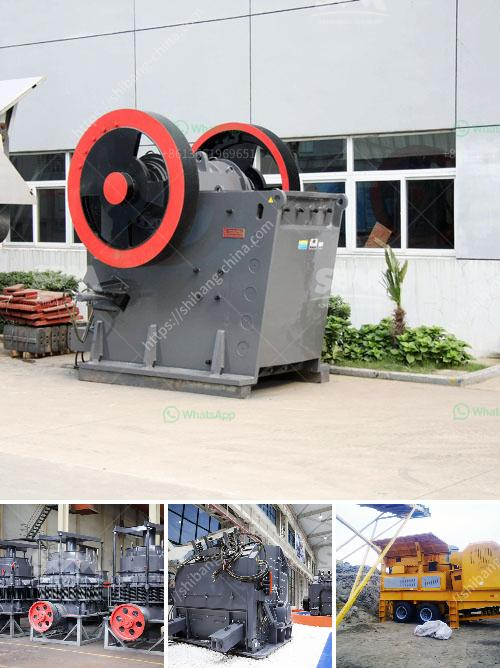

<h3>stone sand making process pdf</h3>
The construction industry has witnessed significant advancements in recent years, and one such revolutionary process is stone sand making. This process involves converting large rocks into small particles of sand, making them suitable for various construction purposes. Stone sand, also known as manufactured sand, is an alternative to natural sand and is widely used across the globe.

The process of making stone sand begins with the extraction of rocks from quarries. These rocks are then crushed into smaller sizes using specialized machinery. The crushed stone is then further processed through a series of crushing, screening, and washing processes to produce high-quality sand particles.

The stone sand making process offers several advantages over natural sand. Firstly, it helps in conserving natural resources as it utilizes rocks that would otherwise go to waste. This reduces the need for excessive sand mining, which can have adverse effects on the environment. Additionally, stone sand has a consistent particle size, which makes it ideal for creating uniform concrete mixes. It also has better shape and texture properties, resulting in improved workability and durability of construction materials.

The use of stone sand in construction projects offers several benefits. It enhances the strength and durability of concrete structures, making them more resistant to cracks and long-term damage. Stone sand also reduces the risk of segregation, bleeding, and shrinkage in concrete, ensuring a smoother and more reliable construction process. Moreover, it provides better control over the quality of construction materials, as the particle size and shape can be tailored according to specific requirements.

In conclusion, the stone sand making process is a revolutionary solution for the construction industry. By efficiently converting rocks into high-quality sand particles, this process enhances the construction materials' performance and sustainability. As the demand for sand continues to rise, stone sand offers a viable alternative that addresses the environmental concerns associated with natural sand extraction.
<h3>Contact us</h3><ul><li><strong>Whatsapp:&nbsp;<a href="https://wa.me/8613661969651">+8613661969651</a></strong></li><li><a href="https://swt.shibang-china.com/?git&amp;zhl&amp;stone sand making process pdf"><strong>Online Service(chat now)</strong></a></li></ul><h3>Related</h3><ul><li><a href='silicon ore processing equipment.md'>silicon ore processing equipment</a></li><li><a href='used stone crusher for sale germany.md'>used stone crusher for sale germany</a></li><li><a href='hammer mill design drawing pdf.md'>hammer mill design drawing pdf</a></li><li><a href='small gravel crusher machine ethiopia.md'>small gravel crusher machine ethiopia</a></li><li><a href='used stone crushing equipment in assam.md'>used stone crushing equipment in assam</a></li></ul>