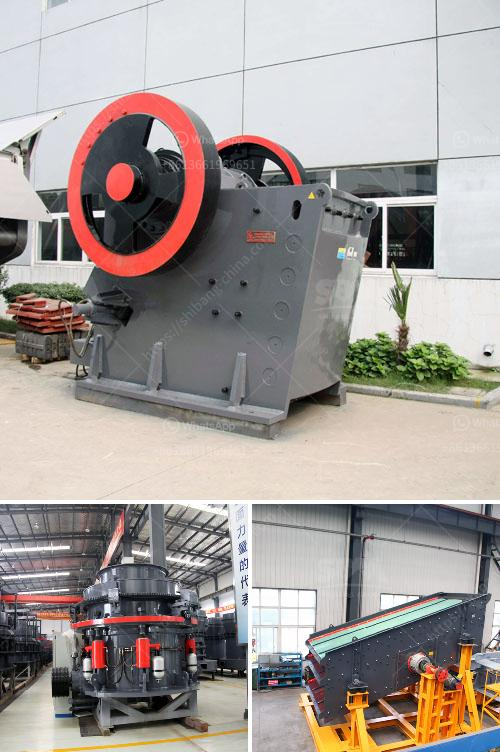

<h3>stone to sand crusher</h3>
Stone to sand crusher is a machine that is used to convert stones into sand. Utilized in industries like construction, foundry, road building, and others, it functions by breaking large stones into smaller pieces. As the name implies, the stone to sand crusher is primarily responsible for producing sand, a finely crushed material that is vital in enhancing the quality of various projects.

The process of stone to sand crusher involves several stages. First, large stones are extracted from the mines through blasting or other mining techniques. These stones are then transported to the crusher plant, where they are further processed. In the crusher, stones are broken down into smaller, more manageable sizes using various crushing techniques.

The primary crusher, usually a jaw crusher or impact crusher, is responsible for reducing the size of the stones. It provides the initial crushing force to break the stones into smaller pieces. Then, the secondary crusher, such as a cone crusher or impact crusher, further refines the crushed materials.

Once the stones are crushed to the desired size, they are sent through a vibrating screen to separate different sizes of stones. The separated larger stones can be sent back for further crushing, while the smaller stones pass through the screen and are collected as fine sand. It is worth noting that the sand produced by stone to sand crushers has desired specifications and is free from impurities, making it suitable for various applications.

The stone to sand crusher is widely used in various industries. In the construction industry, it plays a crucial role in producing sand for concrete and asphalt, which are key materials used in infrastructure projects. The finely crushed sand produced by the crusher enhances the strength and durability of these construction materials.

In the foundry industry, stone to sand crusher is essential for producing high-quality molds, cores, and casting sand. The sand produced is well-rounded and evenly graded, making it ideal for forming molds and cores of complex shapes. Additionally, the crusher machine ensures that the sand is free from impurities, which could otherwise affect the quality of the casting.

Road building is another area where stone to sand crusher finds its significance. The sand produced by the crusher is used as a base material for roads, providing stability and durability. It is also used in the construction of asphalt and concrete pavements, ensuring a smooth driving experience for motorists.

In conclusion, the stone to sand crusher is an essential machine in various industries. Its ability to convert large stones into fine sand makes it valuable in construction, foundry, and road-building applications. The crushed sand produced by the crusher enhances the quality of construction materials and provides stability to roads and pavements. With its efficiency and reliability, the stone to sand crusher helps drive progress and innovation in various sectors.
<h3>Contact us</h3><ul><li><strong>Whatsapp:&nbsp;<a href="https://wa.me/8613661969651">+8613661969651</a></strong></li><li><a href="https://swt.shibang-china.com/?git&amp;zhl&amp;stone to sand crusher"><strong>Online Service(chat now)</strong></a></li></ul><h3>Related</h3><ul><li><a href='vibratory screen design.md'>vibratory screen design</a></li><li><a href='cement plant machine.md'>cement plant machine</a></li><li><a href='track mounted crushers.md'>track mounted crushers</a></li><li><a href='crushing machine from china.md'>crushing machine from china</a></li><li><a href='stone crusher saudi.md'>stone crusher saudi</a></li></ul>