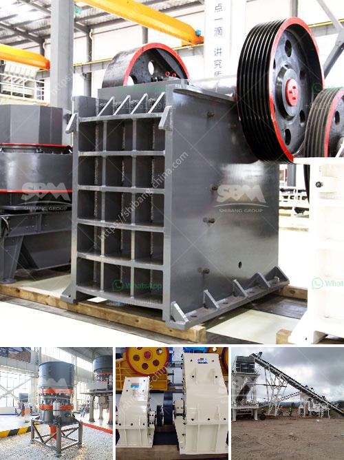

<h3>stones crushing into building sand</h3>
In the field of construction, building sand is an essential component used to create various structures, ranging from residential houses to massive infrastructure projects. Traditionally, building sand has been obtained by riverbed mining or through quarrying, both of which have significant environmental impacts. However, there is a sustainable alternative that not only addresses the environmental concerns but also ensures the availability of high-quality building sand. This solution involves crushing stones into building sand.

Before diving into the benefits of this process, let's explore the concept of stone crushing. Stone crushing is the mechanical process of reducing large stones into smaller fragments of a specific size. This crushing technique is commonly used in the mining industry to extract valuable minerals. However, its application in the production of building sand offers a greener approach.

One of the primary advantages of converting stones into building sand is the reduction of environmental damage caused by traditional sand mining methods. Riverbed mining, for instance, often leads to the ecological imbalance of water bodies, soil erosion, and loss of aquatic life. Similarly, quarrying activities result in the destruction of natural habitats, noise and air pollution, and an overall degradation of the landscape. By crushing stones into building sand, we can significantly limit these adverse effects on our environment.

Furthermore, when stones are transformed into building sand, it creates a circular economy by utilizing waste materials. In various construction processes, such as road construction or building foundations, stones that are deemed unfit for use are left over. These leftover stones can be crushed and transformed into high-quality building sand, eliminating the need for fresh extraction from natural resources. This approach not only reduces the strain on our environment but also minimizes waste and overall resource consumption.

Additionally, the process of crushing stones into building sand ensures a consistent quality product. As opposed to relying on traditional sand mining, where the quality of the extracted sand may vary, stone crushing facilities employ controlled machinery that ensures uniformity in particle size and composition. This consistency is of utmost importance in construction, as it guarantees the structural integrity of the end product.

Moreover, by crushing stones into building sand, we can overcome the issue of diminishing natural sand resources. The demand for sand has been steadily increasing with the booming construction industry, leading to the depletion of riverbeds and excessive quarrying. This scarcity has dire consequences, including rising costs and compromised structural quality. Using an alternative source like crushed stones reduces our reliance on natural sand, ensuring a sustainable supply for future construction projects.

In conclusion, the conversion of stones into building sand is an innovative and sustainable solution for the construction industry. By avoiding traditional sand mining methods, we can protect our environment from harm caused by ecological imbalance and habitat destruction. Additionally, this approach promotes the circular economy by reusing waste materials, resulting in reduced resource consumption and waste generation. Moreover, the consistent quality of the crushed stone product ensures a reliable and structurally sound end product. Finally, by reducing our dependence on natural sand, we can ensure its availability for future generations. The practice of crushing stones into building sand is a testament to the power of innovation and sustainability working in harmony.
<h3>Contact us</h3><ul><li><strong>Whatsapp:&nbsp;<a href="https://wa.me/8613661969651">+8613661969651</a></strong></li><li><a href="https://swt.shibang-china.com/?git&amp;zhl&amp;stones crushing into building sand"><strong>Online Service(chat now)</strong></a></li></ul><h3>Related</h3><ul><li><a href='stone crusher machine price list in kenya.md'>stone crusher machine price list in kenya</a></li><li><a href='turkish association marble machinery.md'>turkish association marble machinery</a></li><li><a href='jaw crusher malaysia.md'>jaw crusher malaysia</a></li><li><a href='raymond mills for sale.md'>raymond mills for sale</a></li><li><a href='small gold ore crusher grinder.md'>small gold ore crusher grinder</a></li></ul>