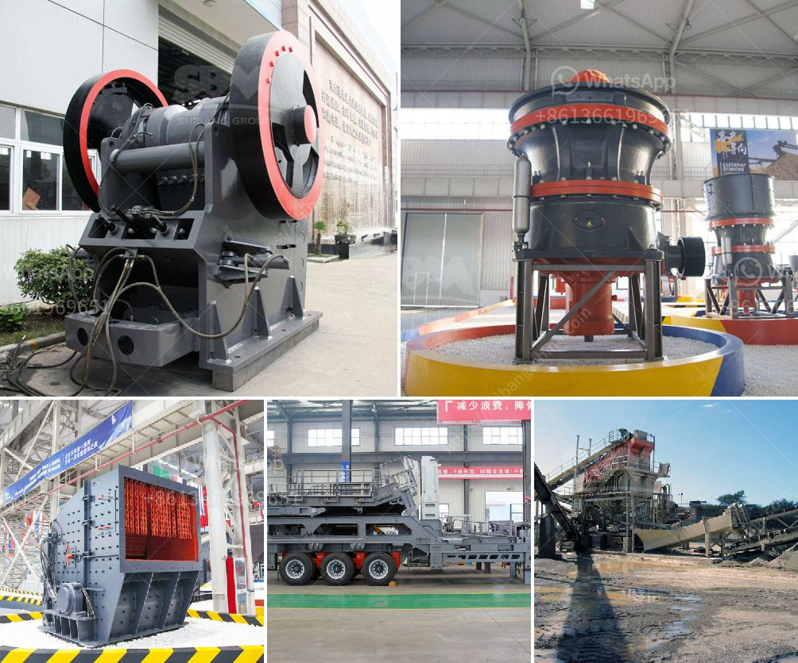

<h3>structural design for crusher plant</h3>
Crusher plant design requires a high level of attention to ensure optimal performance and structural strength. Due to the high pressure forces affecting the plant during crushing operations, it is critical that the design allows for seamless integration and harmonized operation with adjacent structures, equipment, and systems.

The fundamental goal for the design of a crushing plant is an installation that meets the required production requirements, operates at competitive cost, complies with environmental regulations, and can be built at a reasonable price, despite the rising costs of equipment, energy, and construction labor. To achieve these goals, a well-designed plant layout plays a key role.

The first step in designing a successful crushing plant is the proper layout of the plant's structural and functional components. This includes the placement and configuration of key equipment, access and egress routes, and the establishment of clear and safe work areas.

One important aspect of the structural design is the necessary foundations and supports. It is essential to consider the impact forces generated during the crushing process and ensure that the plant's foundation can withstand these loads without settling or shifting. A thorough geotechnical analysis should be performed to determine the soil's bearing capacity and to properly design the foundation system.

Another crucial aspect is the design of the primary and secondary support structures for the crusher and related equipment. These structures must be able to support the weight of the equipment and withstand the dynamic forces created by the crusher's operation. The use of modern design methods, such as finite element analysis, can help optimize structural strength while minimizing material usage and costs.

In addition to the structural aspects, safety and accessibility considerations must be addressed during the design phase. Walkways, stairways, and platforms should be strategically located to provide safe and convenient access for maintenance, inspection, and operation. Adequate guards and protective barriers should be installed to prevent accidental contact with moving parts or falling objects.

Efficient ventilation and dust control systems should also be incorporated into the plant design to minimize the impact of airborne dust on workers and the environment. This can include the installation of dust collection systems, enclosures, and other engineering controls to capture and control emissions.

Moreover, the plant design should take into account the future expansion or modification of the facility. Flexibility in design is essential to accommodate changes in process requirements or the addition of new equipment. By considering potential future needs, the initial plant design can be more cost-effective and avoid costly retrofitting or reconfiguration in the future.

In conclusion, successful design of a crusher plant requires careful consideration of several key factors, including the layout, foundation design, support structures, safety, and accessibility, as well as potential for future expansion. By paying attention to these critical aspects, a well-designed crusher plant can ensure optimal performance, operational efficiency, and maintainability, contributing to the long-term success of the crushing operation.
<h3>Contact us</h3><ul><li><strong>Whatsapp:&nbsp;<a href="https://wa.me/8613661969651">+8613661969651</a></strong></li><li><a href="https://swt.shibang-china.com/?git&amp;zhl&amp;structural design for crusher plant"><strong>Online Service(chat now)</strong></a></li></ul><h3>Related</h3><ul><li><a href='price of ballast crusher machine in kenya.md'>price of ballast crusher machine in kenya</a></li><li><a href='crusher machine philippines.md'>crusher machine philippines</a></li><li><a href='gypsum router machines in uae.md'>gypsum router machines in uae</a></li><li><a href='high chrome impact crusher spare parts.md'>high chrome impact crusher spare parts</a></li><li><a href='mobile rock crushers in ghana.md'>mobile rock crushers in ghana</a></li></ul>