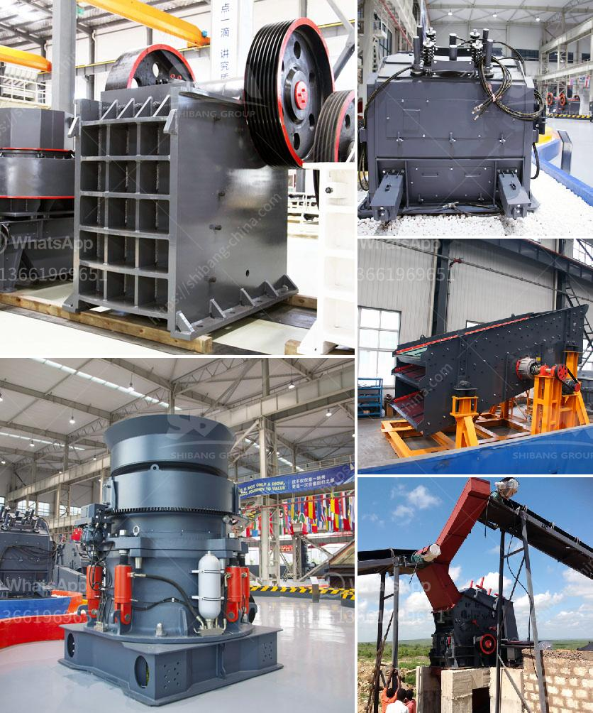

<h3>super fine grinding machine in sri lanka</h3>
Sri Lanka is known for its rich heritage and long-standing traditions in the area of food and agriculture. With a diverse range of crops grown across the country, ranging from paddy, grains, and pulses to various spices, Sri Lankan cuisine has been well-regarded worldwide.

When it comes to traditional food preparation, grinding cereals, spices, and other food products has been an integral part of Sri Lankan culture. However, with the advent of technology, there's been a shift towards more efficient and modern methods of grinding.

One such revolutionary equipment is the super fine grinding machine, which is widely used in various industries such as food, pharmaceuticals, and chemicals. This machine provides a finer and more uniform final product, making it highly desirable for both commercial and domestic use.

The super fine grinding machine in Sri Lanka is an indispensable equipment for traditional and modern cuisine, such as Sri Lankan rice cakes, pumpkin curry, and chili paste. These delicacies usually require a fine powder or paste form to enhance and optimize the taste and texture.

One of the main advantages of using a super fine grinding machine in Sri Lanka is its ability to produce a high-quality and consistently fine powder/mixture. This crucial feature plays a significant role in enhancing the taste and aroma of various dishes. In addition, the finely ground particles also ensure that the ingredients mix uniformly, giving the food a harmonious blend of flavors.

Another advantage of the super fine grinding machine is its versatility. With different settings and a range of options available, this machine can cater to various grinding needs. Whether it's coarse grinding or ultra-fine grinding, the machine can be easily adjusted to achieve the desired consistency.

Furthermore, the super fine grinding machine in Sri Lanka is designed with advanced technology to minimize heat generation during the grinding process. This ensures that the nutritional value, taste, and aroma of the ingredients are preserved, providing a healthier and more flavorful end product.

Moreover, the super fine grinding machine is built with durable and corrosion-resistant materials, ensuring its long lifespan and minimizing maintenance costs. Its sleek and compact design also makes it easy to clean and store, enabling convenient and hassle-free usage.

In conclusion, the super fine grinding machine in Sri Lanka is an invaluable asset for modernizing traditional food preparation processes. With its ability to produce high-quality, uniform powders and pastes, this equipment enhances the taste and texture of various dishes while preserving the nutritional value of the ingredients. Its versatility, advanced technology, and durability make it a must-have for commercial establishments and households alike. So, whether it's to make that perfect curry paste or grind your spices, investing in a super fine grinding machine is a wise choice that will elevate your culinary experience.
<h3>Contact us</h3><ul><li><strong>Whatsapp:&nbsp;<a href="https://wa.me/8613661969651">+8613661969651</a></strong></li><li><a href="https://swt.shibang-china.com/?git&amp;zhl&amp;super fine grinding machine in sri lanka"><strong>Online Service(chat now)</strong></a></li></ul><h3>Related</h3><ul><li><a href='with conveyor price philippines.md'>with conveyor price philippines</a></li><li><a href='grinding equipments grinding equipments.md'>grinding equipments grinding equipments</a></li><li><a href='calcium carbide plant and machinery.md'>calcium carbide plant and machinery</a></li><li><a href='rock crusher distributors in denver colorado.md'>rock crusher distributors in denver colorado</a></li><li><a href='quarry equipment and crushers companies in japan.md'>quarry equipment and crushers companies in japan</a></li></ul>