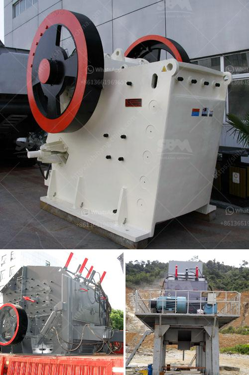

<h3>super fine grinding machine price in india</h3>
India, being a developing country, has extensive manufacturing and commercial sectors. The demand for various products is increasing steadily, leading to a rise in the need for efficient manufacturing processes. Super fine grinding machines are widely used in industries such as mining, metallurgy, building materials, chemicals, abrasive materials, pharmaceuticals, dyes, and others. These machines are designed to grind materials into extremely fine powder, allowing for a higher degree of precision and better performance in various applications.

When considering the price range of super fine grinding machines in India, several factors come into play. The capacity, features, specifications, and overall quality of the machine determine its price. Additionally, the brand reputation and after-sales service also impact the pricing of these machines.

One of the factors that determine the price of super fine grinding machines is their capacity. Higher capacity machines are generally priced higher due to their ability to process larger quantities of materials efficiently. These machines are ideal for industrial settings where large-scale grinding operations are carried out.

The features and specifications of super fine grinding machines can also have a significant effect on their price. Machines with advanced features and better specifications generally come with a higher price tag. Some features that can influence the price include speed control, multiple grinding modes, automatic operation, user-friendly interface, safety features, and dust collection systems. The addition of these features improves the overall performance and functionality of the machines, making them more attractive to users.

The quality of the machine is another crucial factor affecting its price. High-quality materials and components used in the manufacturing process increase the durability and longevity of the machine, but also contribute to a higher price. Well-known manufacturers often invest in research and development to enhance the quality and performance of their machines, leading to higher prices for their products.

Brand reputation plays a significant role in determining the price of super fine grinding machines. Renowned brands with a history of producing reliable and efficient machines often command a premium price due to customer trust and brand value. These brands provide excellent after-sales support, warranty coverage, and spare parts availability, making them a preferred choice for many buyers.

The price range of super fine grinding machines in India varies greatly, starting from around INR 50,000 and going up to several lakhs rupees, depending on the factors mentioned earlier. It is crucial for buyers to consider their specific requirements and budget while selecting a machine. Comparing prices, features, and reviews of different models and brands can help make an informed decision.

It is worth noting that purchasing a super fine grinding machine should be seen as an investment rather than just an expense. These machines are known for their efficiency, precision, and ability to improve overall productivity in various industries. A well-chosen and properly maintained machine can lead to significant cost savings in the long run by reducing labor costs and maximizing output.

In conclusion, the price of super fine grinding machines in India can range from affordable to high-end, depending on factors such as capacity, features, specifications, quality, and brand reputation. Buyers should carefully evaluate their requirements and budget to select a machine that meets their needs. Investing in a high-quality machine can yield substantial benefits in terms of enhanced productivity and cost savings in the long term.
<h3>Contact us</h3><ul><li><strong>Whatsapp:&nbsp;<a href="https://wa.me/8613661969651">+8613661969651</a></strong></li><li><a href="https://swt.shibang-china.com/?git&amp;zhl&amp;super fine grinding machine price in india"><strong>Online Service(chat now)</strong></a></li></ul><h3>Related</h3><ul><li><a href='portable concrete crusher for rent qatar.md'>portable concrete crusher for rent qatar</a></li><li><a href='mini crusher hire johannesburg.md'>mini crusher hire johannesburg</a></li><li><a href='stone crushing equipment available.md'>stone crushing equipment available</a></li><li><a href='business plan for gypsum production.md'>business plan for gypsum production</a></li><li><a href='grinding cost calculation for bm 8 usha mill.md'>grinding cost calculation for bm 8 usha mill</a></li></ul>