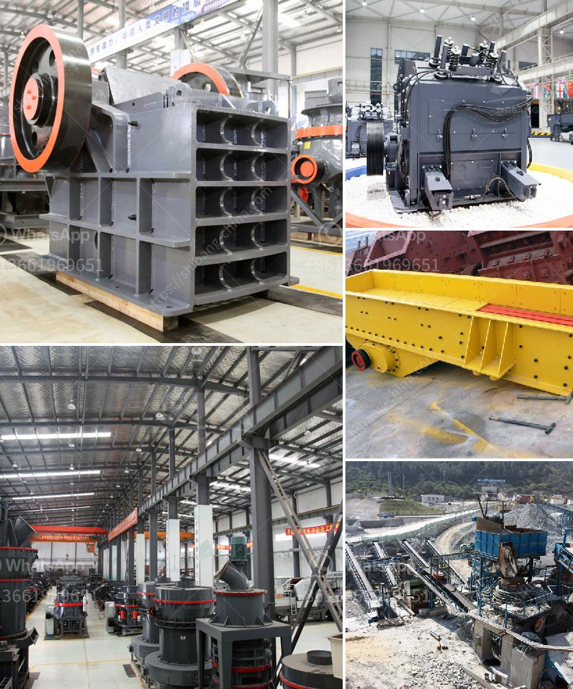

<h3>superfine grinding mills in shanhgai</h3>
The development of the mineral processing industry is always closely linked with the advancement of grinding technology. Grinding mills play a key role in this field, as they are capable of grinding various materials to achieve desired particle sizes, making them crucial tools for a wide range of applications.

Shanghai, known as the "Millennium City," boasts a rich industrial heritage and has been at the forefront of technological advancements in various industries. In recent years, Shanghai has become a hub for superfine grinding mills that are revolutionizing the mineral processing industry.

Superfine grinding mills are a type of grinding equipment used to grind materials into extremely fine powders. Their high energy efficiency and ability to produce ultrafine particles have made them increasingly popular in the mineral processing industry. These mills utilize advanced grinding media and technology to grind materials to unprecedented levels of fineness, ensuring superior product quality.

One of the leading manufacturers of superfine grinding mills in Shanghai is XYZ Company. With a focus on research and development, XYZ Company has revolutionized the grinding technology with its innovative designs and superior engineering. Their mills are equipped with state-of-the-art control systems that allow for precise control of the grinding process, ensuring optimal performance and product quality.

The superfine grinding mills manufactured in Shanghai offer a wide range of applications, including the grinding of minerals, chemicals, pharmaceuticals, and even food products. The ability to produce extremely fine particles increases the surface area of the material, resulting in improved product characteristics such as enhanced reactivity, increased solubility, and better dispersion.

Moreover, Shanghai's superfine grinding mills are designed to be energy-efficient, reducing operational costs while minimizing environmental impact. The mills are equipped with advanced energy-saving technologies and can be tailored to specific customer requirements, maximizing both productivity and sustainability.

In conclusion, the superfine grinding mills manufactured in Shanghai have brought a revolution to the mineral processing industry. These advanced mills offer unparalleled grinding capabilities, producing ultrafine particles and superior product quality. With their energy efficiency and customizable features, these mills are transforming the way materials are processed, setting new standards for the industry. As Shanghai continues to innovate in grinding technology, it solidifies its position as a global leader in the mineral processing industry.
<h3>Contact us</h3><ul><li><strong>Whatsapp:&nbsp;<a href="https://wa.me/8613661969651">+8613661969651</a></strong></li><li><a href="https://swt.shibang-china.com/?git&amp;zhl&amp;superfine grinding mills in shanhgai"><strong>Online Service(chat now)</strong></a></li></ul><h3>Related</h3><ul><li><a href='quartz stone processing machine.md'>quartz stone processing machine</a></li><li><a href='stone crusher with tractor.md'>stone crusher with tractor</a></li><li><a href='crusher machine for sale in pakistan.md'>crusher machine for sale in pakistan</a></li><li><a href='hammer crusher parameters introduced in detail.md'>hammer crusher parameters introduced in detail</a></li><li><a href='purification process of iron ore.md'>purification process of iron ore</a></li></ul>