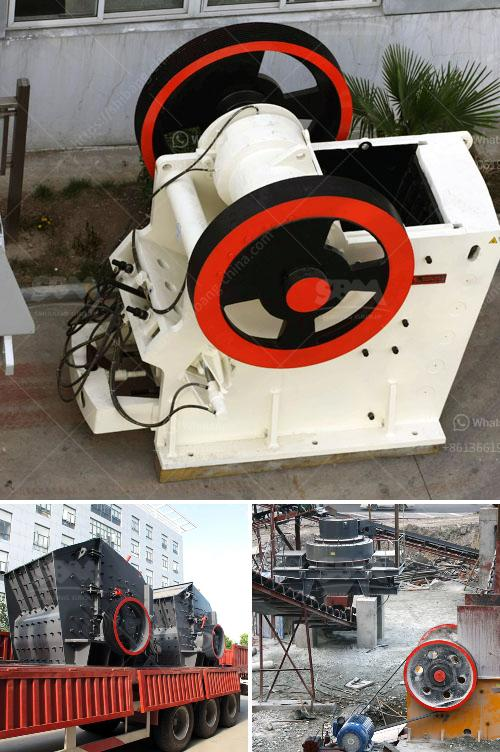

<h3>supplier of grinding stone</h3>
Grinding stones have been an essential tool for various industries for centuries. From sharpening blades to smoothing surfaces, these abrasive tools have proven their worth time and again. However, to ensure high-quality and efficient results, it is crucial to source grinding stones from reliable suppliers. With numerous options available in the market, it is essential to weigh your choices and find a reputable supplier that meets your specific needs.

One of the primary factors to consider when selecting a supplier for grinding stones is the quality and durability of their products. High-quality grinding stones deliver superior performance and longevity, reducing the need for frequent replacements. It is advisable to look for suppliers who prioritize the use of premium materials and state-of-the-art manufacturing processes to ensure consistent and reliable results for their customers.

Another key consideration is the supplier's product range and their ability to provide customized solutions. Different grinding tasks require specific stone characteristics, such as grit size, hardness, and composition. Choose a supplier that offers a diverse range of grinding stones suitable for different applications, from precision grinding to heavy-duty tasks. Furthermore, a supplier who can cater to your specific customization requirements ensures a tailored solution that meets your unique needs.

Reliability is crucial when it comes to grinding stone suppliers. You need a supplier that consistently delivers high-quality products, adhering to industry standards and regulations. By choosing a reliable supplier, you minimize the risk of receiving subpar products that may compromise your productivity and overall output.

While quality is important, it is equally crucial to consider the affordability and cost-effectiveness of grinding stones. Look for suppliers that offer competitive prices without compromising on the quality of their products. Evaluating the cost per use is essential as it helps determine the long-term value of the stones you purchase.

Lastly, a reputable grinding stone supplier should prioritize customer support and after-sales service. Whether you need technical assistance, guidance, or have concerns about the purchased products, a supplier with a strong customer support system ensures prompt and effective resolution of any issues that may arise.

Selecting the right supplier of grinding stones is crucial for ensuring optimal performance, efficiency, and cost-effectiveness. By prioritizing quality, customization options, reliability, affordability, and excellent customer service, you can find a supplier that meets your specific requirements. Investing time and effort into choosing the right supplier will result in a long-lasting partnership, providing you with the grinding stones tailored to your needs and delivering consistent results.
<h3>Contact us</h3><ul><li><strong>Whatsapp:&nbsp;<a href="https://wa.me/8613661969651">+8613661969651</a></strong></li><li><a href="https://swt.shibang-china.com/?git&amp;zhl&amp;supplier of grinding stone"><strong>Online Service(chat now)</strong></a></li></ul><h3>Related</h3><ul><li><a href='maintenance plan of crusher.md'>maintenance plan of crusher</a></li><li><a href='mobile cone crusher for sale.md'>mobile cone crusher for sale</a></li><li><a href='the vertical mill ireland information.md'>the vertical mill ireland information</a></li><li><a href='impact crusher china.md'>impact crusher china</a></li><li><a href='new technology stone crusher in india.md'>new technology stone crusher in india</a></li></ul>