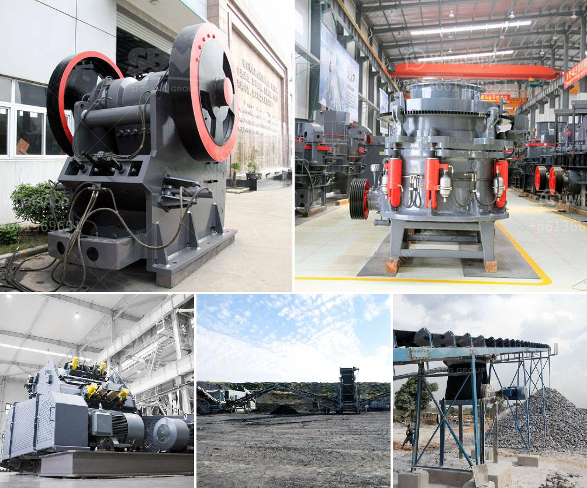

<h3>suppliers kenya crusher</h3>
Kenya is a highly industrious country where thousands of industries and manufacturing plants operate. The need for efficient and reliable crusher equipment is on the rise as more and more industries seek to streamline their operations. A crusher is a machine designed to reduce large rocks into smaller rocks, gravel, or rock dust, which can be used for various purposes, including construction, road building, manufacturing, and mining.

Finding the right suppliers in Kenya for crusher equipment is crucial for any business looking to invest in this essential tool. There are several factors to consider when choosing the best supplier that will meet your specific requirements.

Firstly, it is essential to determine the type of crusher that suits your needs. Crushers come in various models, such as jaw crushers, cone crushers, impact crushers, and vertical shaft impact crushers. Each model serves a different purpose and is suitable for different applications. Understanding your specific requirements will help you choose the right supplier who can provide the necessary equipment.

Secondly, it is vital to consider the supplier's reputation and experience in the industry. A reliable and reputable supplier will have a track record of providing quality crusher equipment to satisfied customers. You can perform online research, read customer reviews, and seek recommendations from industry experts to assess the supplier's reliability. Furthermore, an experienced supplier will be knowledgeable about the different types of crushers and can provide valuable insights and guidance in selecting the most appropriate equipment for your needs.

Another important aspect to consider is the supplier's after-sales service and support. Investing in crusher equipment is a significant financial commitment, and you need to ensure that you will receive prompt assistance and maintenance services when needed. A supplier with excellent after-sales support will provide regular maintenance, spare parts, and technical assistance to keep your crusher running efficiently and minimize downtime.

Additionally, it is crucial to consider the supplier's pricing and payment terms. While it is essential to find a supplier that offers competitive pricing, the price should not be the sole determining factor. Quality and reliability should take precedence over price alone. However, it is still important to have a clear understanding of the pricing structure and payment terms before making the final decision.

Lastly, it is recommended to visit the supplier's facility or showroom in person, if possible. This will give you an opportunity to examine the equipment's quality, durability, and overall condition. It will also allow you to communicate directly with the supplier's representatives and address any concerns or questions you may have.

In conclusion, selecting the right supplier for crusher equipment in Kenya is crucial for any business looking to avail of this essential tool. Conducting thorough research, considering the supplier's reputation, experience, after-sales support, and visiting their facility will help you make an informed decision. By choosing a reliable supplier, you can ensure that you receive high-quality equipment that meets your specific requirements, giving your business the competitive edge it needs in today's demanding marketplace.
<h3>Contact us</h3><ul><li><strong>Whatsapp:&nbsp;<a href="https://wa.me/8613661969651">+8613661969651</a></strong></li><li><a href="https://swt.shibang-china.com/?git&amp;zhl&amp;suppliers kenya crusher"><strong>Online Service(chat now)</strong></a></li></ul><h3>Related</h3><ul><li><a href='grinding raymond dolomite.md'>grinding raymond dolomite</a></li><li><a href='quotation for hydraulic cone crusher.md'>quotation for hydraulic cone crusher</a></li><li><a href='sand processing plant for sale.md'>sand processing plant for sale</a></li><li><a href='wet ball mills manufacturers.md'>wet ball mills manufacturers</a></li><li><a href='high performance mobile crushing machine for sale.md'>high performance mobile crushing machine for sale</a></li></ul>