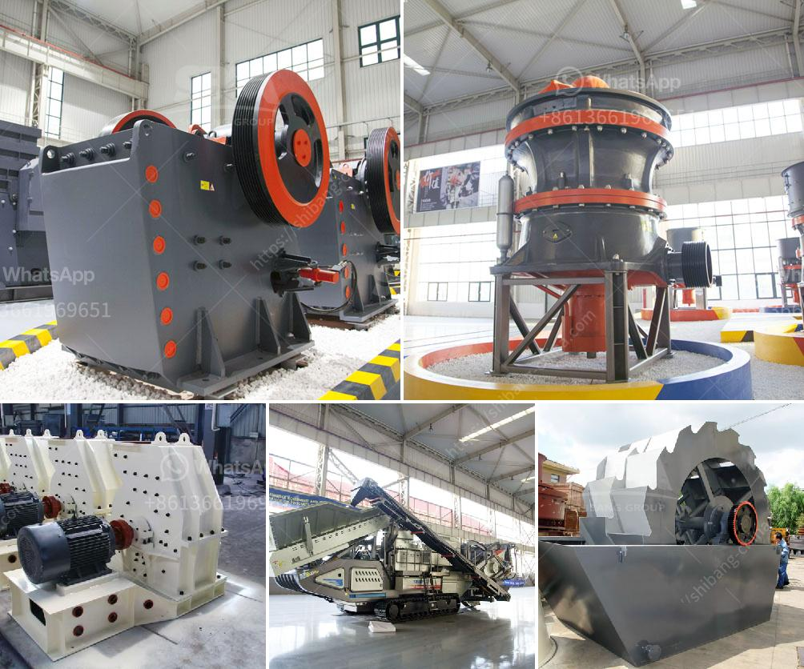

<h3>suppliers of crush or rocks pretoria</h3>
When it comes to construction or landscaping projects, the quality of materials used plays a crucial role in the success and longevity of the end result. For those in and around Pretoria, the availability of reliable suppliers of crushed rocks is a boon. Not only do they provide essential materials for various applications, but they ensure that quality is never compromised. Let's explore why crushed rocks are popular and some trustworthy suppliers in Pretoria.

Crushed rocks are a versatile material widely used in construction and landscaping. They are created by mechanically crushing larger rocks into smaller pieces. These smaller rock fragments, ranging from various sizes, are ideal for numerous applications, including road base construction, filling, drainage systems, and decorative purposes. Their durability, strength, and ability to withstand heavy loads make them an indispensable part of many projects.

When it comes to finding suppliers of crushed rocks in Pretoria, there are several reliable options to consider. These suppliers understand the importance of providing quality materials to ensure the success of every project. Here are a few notable suppliers that have built a solid reputation within the industry:

1. Afrisam: With decades of experience, Afrisam is a leading supplier of construction materials in South Africa. They offer a range of crushed rocks in various sizes and types, including crushed stone, Gabion rock, and G5 sub-base material. Their strict quality control measures and commitment to sustainable practices make them a preferred choice for many.

2. Instant Lawn: While primarily known for their turf and grass services, Instant Lawn also supplies crushed rocks of superior quality. Their products, sourced from trusted quarries, meet industry standards and are available in different sizes to suit every project's requirements.

3. Beijer Hardware: As a well-established hardware store, Beijer Hardware provides a wide range of construction and landscaping materials, including crushed rocks. Their commitment to customer satisfaction and competitive prices make them a reliable option for builders, landscapers, and DIY enthusiasts.

4. Pebbles for Africa: Specializing in decorative rock products, Pebbles for Africa offers a range of crushed rocks that can enhance the visual appeal of any project. From pebbles to gravel and crushed stone, they provide an array of options to suit individual preferences. With a strong focus on customer service, they ensure that all materials are of the highest quality.

When choosing a supplier for crushed rocks, it is essential to consider factors such as reputation, product variety, pricing, and customer service. It is recommended to consult with multiple suppliers to compare offerings before making a final decision. Additionally, ensure that the suppliers provide timely delivery services to your project site.

In conclusion, suppliers of crushed rocks in Pretoria provide essential materials for a wide range of construction and landscaping projects. By choosing reliable suppliers, such as Afrisam, Instant Lawn, Beijer Hardware, or Pebbles for Africa, customers can rest assured that they are receiving high-quality materials that meet industry standards. So, whether you are constructing a sturdy road base or creating an aesthetically pleasing landscape, these suppliers are dedicated to enhancing your project with top-notch materials.
<h3>Contact us</h3><ul><li><strong>Whatsapp:&nbsp;<a href="https://wa.me/8613661969651">+8613661969651</a></strong></li><li><a href="https://swt.shibang-china.com/?git&amp;zhl&amp;suppliers of crush or rocks pretoria"><strong>Online Service(chat now)</strong></a></li></ul><h3>Related</h3><ul><li><a href='basalt crusher plant price.md'>basalt crusher plant price</a></li><li><a href='mobile crusher in japan used crusher.md'>mobile crusher in japan used crusher</a></li><li><a href='land available for stone quarry.md'>land available for stone quarry</a></li><li><a href='calcium carbonate plants in qatar.md'>calcium carbonate plants in qatar</a></li><li><a href='the standard slag crusher.md'>the standard slag crusher</a></li></ul>