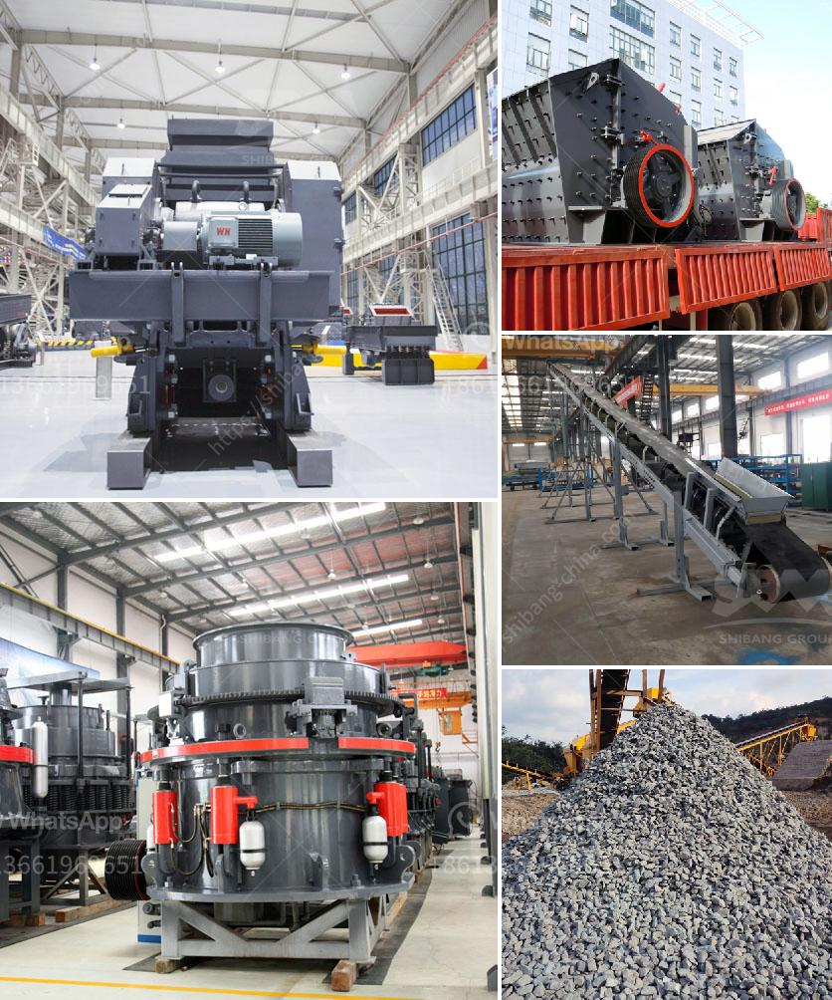

<h3>suppliers of mining mills in south africa</h3>
South Africa is known for its abundant mineral resources, with gold, diamond, and platinum being among the key commodities mined. Mining plays a crucial role in the country's economy, contributing significantly to employment and GDP. To extract these valuable resources, mining mills are indispensable. They are used to grind and crush rocks into smaller particles for further processing.

With the increasing demand for minerals globally, the demand for mining mills in South Africa has also surged. This has led to a rise in the number of suppliers specializing in manufacturing and supplying mining mills in the country. These suppliers play a vital role in meeting the industry's growing needs and maintaining a sustainable supply chain.

One of the renowned suppliers of mining mills in South Africa is ABC Hansen Africa. They have been serving the mining industry for over three decades, providing durable and efficient mills that cater to various mining operations. Their mills are known for their robust construction, high-performance capabilities, and ability to withstand the demanding conditions often encountered in mining operations.

Another prominent supplier in the industry is BME, a member of the Omnia Group. They provide a wide range of mining solutions, including mills, explosives, and blasting systems. BME's mills are designed to optimize mineral processing operations while enhancing safety and productivity.

Dakota Mining and Quarry Equipment is another reliable supplier of mining mills in South Africa. With a focus on providing turnkey solutions, they offer mills that are customized to meet the specific requirements of each mining operation. Dakota's mills are backed by their technical expertise and commitment to delivering top-quality equipment.

These suppliers understand the unique challenges faced by the mining industry and offer comprehensive support services, including installation, maintenance, and 24/7 technical assistance. Their dedication to customer satisfaction ensures that mining mills are delivered on time and in optimal working condition.

In conclusion, the suppliers of mining mills in South Africa play a crucial role in supporting the country's mining industry. Their expertise and quality products are instrumental in meeting the growing demand for mineral resources globally. As the mining sector continues to evolve, these suppliers will continue to innovate and provide cutting-edge solutions to ensure efficient and sustainable mining operations in South Africa.
<h3>Contact us</h3><ul><li><strong>Whatsapp:&nbsp;<a href="https://wa.me/8613661969651">+8613661969651</a></strong></li><li><a href="https://swt.shibang-china.com/?git&amp;zhl&amp;suppliers of mining mills in south africa"><strong>Online Service(chat now)</strong></a></li></ul><h3>Related</h3><ul><li><a href='ball mill in ceramic industry.md'>ball mill in ceramic industry</a></li><li><a href='silico manganese manufacturing equipment.md'>silico manganese manufacturing equipment</a></li><li><a href='business plan of stone crushing companies.md'>business plan of stone crushing companies</a></li><li><a href='cost of establishing a quarry in nigeria.md'>cost of establishing a quarry in nigeria</a></li><li><a href='quartz crushing plant.md'>quartz crushing plant</a></li></ul>