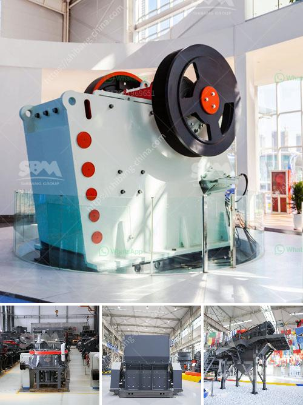

<h3>talcum powder machine</h3>
Talcum powder, also known as baby powder, has been used for a variety of purposes for centuries. From personal hygiene to industrial applications, talcum powder has become an indispensable product in our daily lives. However, the production of this fine powder requires specialized machinery to ensure quality and efficiency. Enter the talcum powder machine – an innovative solution designed to meet the diverse needs of various industries.

Talcum powder machines come in different sizes and configurations, each tailored to the specific requirements of the production process. These machines enable the grinding, milling, and sieving of raw talc into a fine powder, ensuring a consistent particle size distribution. The complete talcum powder manufacturing process involves several stages, and a well-designed machine simplifies each step, resulting in a smooth and efficient workflow.

One crucial aspect of talcum powder machines is their ability to handle different types of talc with varying properties. Talc deposits can differ in hardness, purity, and composition, leading to variations in the final product. To address this challenge, modern machines employ advanced technologies that adjust grinding parameters, such as grinding speed, pressure, and airflow, to achieve the desired powder characteristics.

Efficiency and safety are paramount in any industrial operation, and talcum powder machines prioritize both aspects. For efficient production, these machines are equipped with high-performance motors and precise cutting tools. They also incorporate automation systems, allowing for continuous operation with minimal manual intervention. Moreover, safety features, such as interlocks and emergency stop buttons, ensure the well-being of operators and prevent accidents.

The versatility of talcum powder machines enables their use in various industries. In the personal care sector, these machines are employed to produce cosmetic talcum powders, including body powders, face powders, and talc-based baby powders. By refining the raw material into a fine powder, these machines ensure a soft and smooth texture that is safe for sensitive skin and gentle enough for everyday use.

Beyond personal care, talcum powder machines find applications in other industries as well. In the pharmaceutical industry, talc powder is utilized as an ingredient in medicinal and healthcare products. These machines ensure the purity and uniformity of talc powder, meeting the rigorous standards set by regulatory authorities. Additionally, talcum powder machines are used in the plastics and rubber sectors, aiding in the production of molded products by acting as an anti-blocking agent and a lubricant.

In conclusion, talcum powder machines play a critical role in the production of talcum powder. Their ability to process different types of talc, while providing efficiency and safety, makes them an essential investment for various industries. With the global demand for talc-based products increasing, the development of more advanced talcum powder machines is expected. From personal care to pharmaceuticals and beyond, these machines continue to shape the production processes, ensuring that talcum powder remains a versatile solution for numerous applications.
<h3>Contact us</h3><ul><li><strong>Whatsapp:&nbsp;<a href="https://wa.me/8613661969651">+8613661969651</a></strong></li><li><a href="https://swt.shibang-china.com/?git&amp;zhl&amp;talcum powder machine"><strong>Online Service(chat now)</strong></a></li></ul><h3>Related</h3><ul><li><a href='gravel jaw crusher.md'>gravel jaw crusher</a></li><li><a href='used machines philippines ball mill.md'>used machines philippines ball mill</a></li><li><a href='how does a jaw crusher limestone.md'>how does a jaw crusher limestone</a></li><li><a href='counties roller mills.md'>counties roller mills</a></li><li><a href='coal mining plant in ethiopia.md'>coal mining plant in ethiopia</a></li></ul>