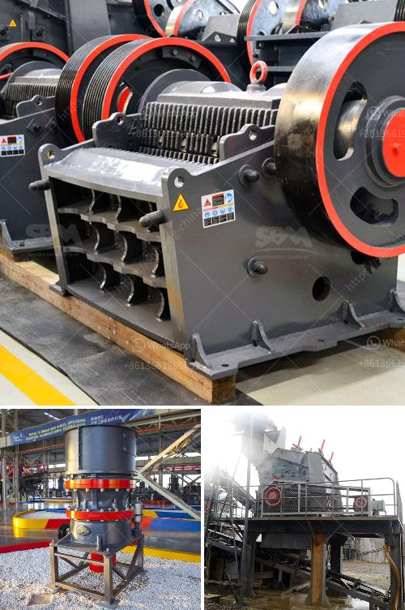

<h3>talcum powder mill manufacturing</h3>
Talcum powder, also known as baby powder, has been used for decades for its various purposes. From personal hygiene to soothing skin irritations, talcum powder has become a staple in many households. However, few people are aware of the manufacturing process involved in creating this versatile product.

The manufacturing of talcum powder begins with the extraction of talc from mines. This mined talc is then crushed into a powder form. The powder undergoes a meticulous process to ensure its purity and quality for commercial use.

After extraction, the talc undergoes several processes to remove any impurities. These impurities can include dirt, rocks, or other minerals present in the mined talc. Once the talc has been purified, it is then crushed, dried, and milled to obtain the desired consistency.

The milling process is crucial in determining the final product's texture and fineness. Different types of mills are used to achieve the desired outcome. Some common methods include the use of ball mills, jet mills, or hammer mills. These mills crush and grind the talc into a fine powder.

Once the talcum powder has been milled, it is then packed in various packaging materials such as bottles, cans, or pouches. These packaging materials ensure the product remains intact and protected from external elements.

It is important to note that talcum powder manufacturing undergoes strict quality control measures to ensure its safety for consumers. Regular testing is conducted to check for any microbial contamination, heavy metal presence, or any other harmful substances.

In conclusion, the manufacturing process of talcum powder is a meticulous one. From the extraction of talc to its milling and packaging, several steps are involved to ensure the production of a high-quality product. While talcum powder has a range of uses, it is essential to understand the responsible manufacturing processes behind its creation.
<h3>Contact us</h3><ul><li><strong>Whatsapp:&nbsp;<a href="https://wa.me/8613661969651">+8613661969651</a></strong></li><li><a href="https://swt.shibang-china.com/?git&amp;zhl&amp;talcum powder mill manufacturing"><strong>Online Service(chat now)</strong></a></li></ul><h3>Related</h3><ul><li><a href='quarries rock crushing process.md'>quarries rock crushing process</a></li><li><a href='depreciacion de molino industrial.md'>depreciacion de molino industrial</a></li><li><a href='stone quarry machines in uganda for sale.md'>stone quarry machines in uganda for sale</a></li><li><a href='impact crusher china.md'>impact crusher china</a></li><li><a href='turkey gold processing plants.md'>turkey gold processing plants</a></li></ul>