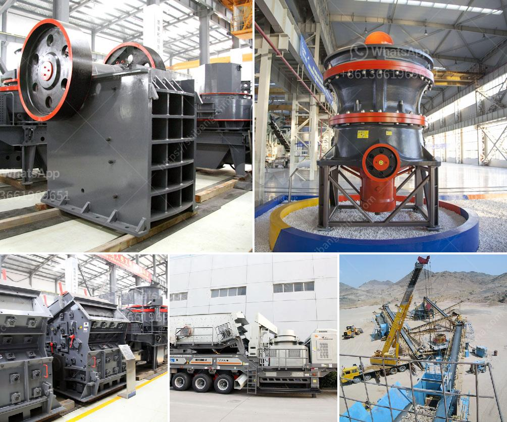

<h3>tanzania medical equipment supplier</h3>
Tanzania, a country located in East Africa, has made commendable progress in improving its healthcare system in recent years. Part of this progress can be attributed to the presence of reliable medical equipment suppliers in the country. These suppliers play a vital role in ensuring the availability of high-quality medical equipment and supplies, ultimately enhancing the overall healthcare infrastructure in Tanzania.

One of the key challenges faced by the healthcare sector in Tanzania is the lack of access to modern medical equipment and supplies. This is primarily due to a shortage of suppliers and inadequate distribution networks. However, the emergence of dedicated medical equipment suppliers has helped bridge this gap and provide much-needed support to healthcare facilities across the country.

By partnering with reputable international manufacturers, these Tanzanian medical equipment suppliers can offer a wide range of cutting-edge medical devices, including imaging equipment, laboratory instruments, surgical tools, and much more. Moreover, these suppliers also ensure the provision of essential consumables and disposables, such as disinfectants, gloves, and syringes, which are crucial for maintaining proper hygiene standards and ensuring patient safety.

The availability of modern medical equipment not only improves the quality of healthcare services but also enhances the accuracy and efficiency of medical diagnoses and treatments. Equipping hospitals and clinics with state-of-the-art technology enables healthcare professionals to deliver prompt and accurate care, leading to better patient outcomes and an overall improvement in the country's healthcare system.

Furthermore, these suppliers often provide comprehensive after-sales support, including maintenance, servicing, and training programs. This ensures that healthcare professionals receive proper training to operate and maintain the equipment effectively, prolonging its lifespan and maximizing its utility.

In addition to addressing the immediate needs of healthcare facilities, Tanzanian medical equipment suppliers also contribute to the long-term development of the healthcare sector. By investing in research and development, they help introduce innovative and cost-effective solutions that can benefit both urban centers and remote rural areas, where access to healthcare services is limited.

In conclusion, the presence of reliable medical equipment suppliers in Tanzania plays a crucial role in improving the healthcare infrastructure of the country. Through their partnerships with international manufacturers, they ensure the availability of modern medical equipment and supplies, enhancing the quality of healthcare services and improving patient outcomes. Their commitment to after-sales support and investment in research and development further contribute to the long-term development of the healthcare sector. As Tanzania continues to make progress in its healthcare system, the role of these medical equipment suppliers remains indispensable.
<h3>Contact us</h3><ul><li><strong>Whatsapp:&nbsp;<a href="https://wa.me/8613661969651">+8613661969651</a></strong></li><li><a href="https://swt.shibang-china.com/?git&amp;zhl&amp;tanzania medical equipment supplier"><strong>Online Service(chat now)</strong></a></li></ul><h3>Related</h3><ul><li><a href='malaysia heavy industries crushing equipment china.md'>malaysia heavy industries crushing equipment china</a></li><li><a href='brick crushers for sale in australia.md'>brick crushers for sale in australia</a></li><li><a href='cone crusher contractors in egypt.md'>cone crusher contractors in egypt</a></li><li><a href='5kg grinding ball mill.md'>5kg grinding ball mill</a></li><li><a href='manufacturers of conveyor belts in malaysia.md'>manufacturers of conveyor belts in malaysia</a></li></ul>