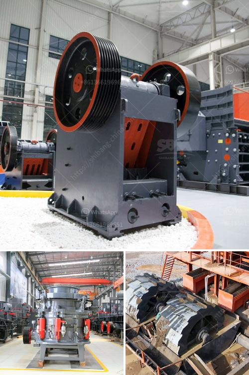

<h3>technology of conveyor belts</h3>
Conveyor belts have been an integral part of various industries, facilitating the transportation of goods and materials from one location to another. Over the years, there have been significant advancements in the technology of conveyor belts, leading to improvements in efficiency, durability, and safety. These advancements have revolutionized the way industries operate, allowing for increased productivity and reduced manual labor. In this article, we will explore some of the notable technological advancements in conveyor belt systems.

One of the key advancements in conveyor belt technology has been the development of modular belts. Traditional conveyor belts were made of a single continuous loop, which made installation and maintenance cumbersome. Modular belts, on the other hand, consist of interlocking modules that can be easily removed and replaced when needed. This modular design allows for quick and efficient repairs, resulting in minimal downtime and increased productivity.

Another significant technological advancement is the integration of sensors and automation into conveyor belt systems. Sensors are now being incorporated into conveyor belts to monitor various parameters such as speed, temperature, and product weight. This real-time data allows for better control and optimization of the production process. For example, if a sensor detects a deviation in product weight, it can automatically trigger the conveyor belt to adjust its speed or divert the product for further inspection, ensuring quality control.

Automation has also played a crucial role in enhancing the efficiency of conveyor belt systems. Automated conveyor belts can be programmed to perform various tasks such as sorting, merging, and diverting products based on predefined parameters. This reduces the need for manual intervention and streamlines the production process. Furthermore, automation enables conveyor belts to be seamlessly integrated with other machinery and systems, creating a more interconnected and efficient production line.

In terms of material advancements, the development of stronger and more durable conveyor belt materials has significantly improved the longevity and reliability of conveyor belts. Traditional conveyor belts were prone to wear and tear, especially in industries with harsh operating conditions. However, with the introduction of materials such as rubber compounds, polyester, and aramid fibers, conveyor belts now offer increased resistance to abrasion, impact, and chemical exposure. Moreover, these materials are also more environmentally friendly, as they can be recycled or disposed of in a sustainable manner.

Safety has also been a major focus in the technological advancements of conveyor belts. The integration of advanced safety features such as emergency stop buttons, safety interlocks, and protective guarding has greatly reduced the risk of accidents and injuries. Additionally, conveyor belts can now be equipped with advanced monitoring systems that detect potential hazards such as belt misalignment, excessive vibration, or overheating. These systems can automatically shut down the conveyor belt or send alerts to operators, ensuring a safer working environment.

In conclusion, the technology of conveyor belts has come a long way, with significant advancements in modular design, sensor integration, automation, material strength, and safety features. These advancements have redefined the efficiency, durability, and safety standards of conveyor belt systems, enabling industries to streamline their processes and increase productivity. As technology continues to evolve, we can expect further innovations in conveyor belt technology that will further enhance the capabilities of these indispensable systems.
<h3>Contact us</h3><ul><li><strong>Whatsapp:&nbsp;<a href="https://wa.me/8613661969651">+8613661969651</a></strong></li><li><a href="https://swt.shibang-china.com/?git&amp;zhl&amp;technology of conveyor belts"><strong>Online Service(chat now)</strong></a></li></ul><h3>Related</h3><ul><li><a href='sell plant crusher of stone.md'>sell plant crusher of stone</a></li><li><a href='earthen clay products manufacturing process.md'>earthen clay products manufacturing process</a></li><li><a href='kaolin raymond mill price.md'>kaolin raymond mill price</a></li><li><a href='nigeria stone crusher to buy.md'>nigeria stone crusher to buy</a></li><li><a href='chaines talc granding company in malaysia.md'>chaines talc granding company in malaysia</a></li></ul>