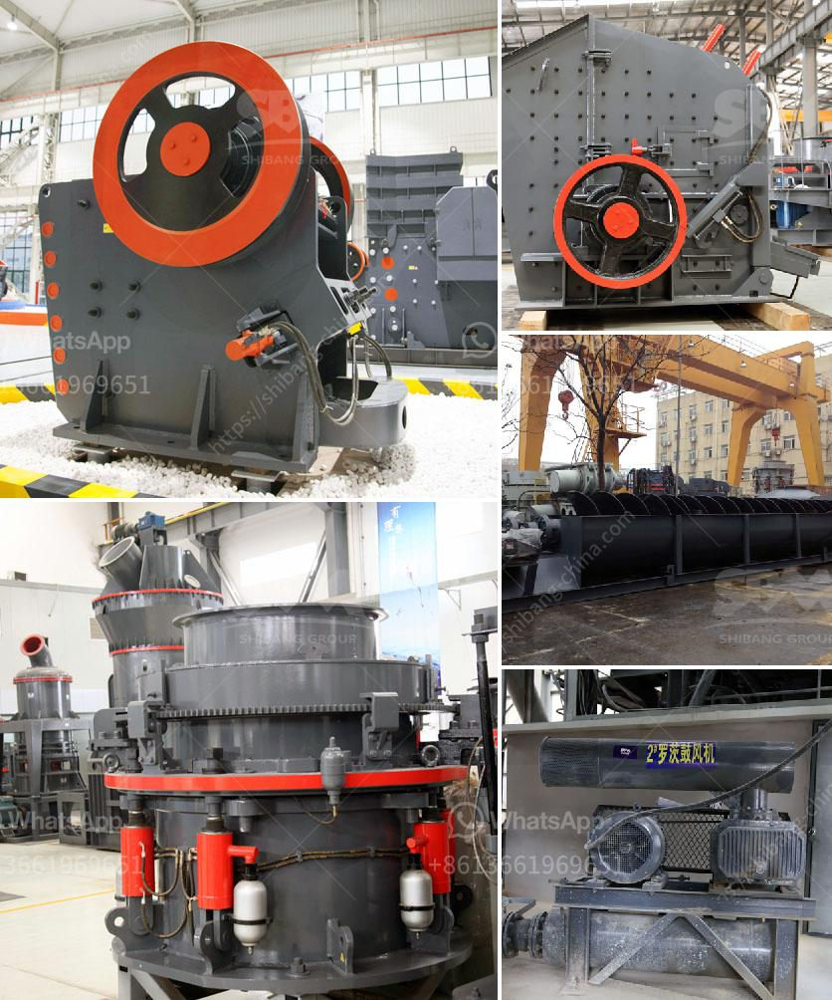

<h3>the estimated cost of setting up a quarry</h3>
The estimated cost of setting up a quarry sometimes known as stone mining is an important factor when planning on starting a new business. The cost factors involved in this process include the labor, raw materials, equipment, and machinery needed to run the quarry. The cost of labor is also an important consideration since the average wage in most countries is quite high. Additionally, the cost of purchasing or renting land is another important factor to consider.

Firstly, the cost of labor plays a significant role in determining how much it will take to set up a quarry. The number of workers needed to run a quarry depends on the size of the quarry and the amount of production required. Generally, large quarries employ many workers, while smaller ones may only require a few. Salaries for quarry workers can vary greatly depending on the location and country. For instance, labor costs in developed countries with high wages are likely to be significantly higher compared to developing nations with lower wages.

Secondly, the cost of raw materials such as stone and explosives is also crucial in estimating the total cost of the quarry. Stone is used to produce crushed stone, which is crucial for various construction projects. The cost of stone can vary depending on the location and quality. Explosives are needed to extract the stone from the quarry and can be quite expensive. Environmental regulations may also require the use of expensive equipment or methods to mitigate the impact of explosions on the surrounding area, further adding to the cost.

Thirdly, the cost of equipment and machinery needed to run a quarry can be significant. Excavators, loaders, crushers, and hauling equipment are essential for the operation of a quarry. These machines can be expensive to purchase or lease. Additionally, maintenance and repair costs for these machines should also be factored in.

Furthermore, the cost of land is an important consideration when planning to set up a quarry. The size and location of the quarry will dictate the amount of land needed. Often, quarries are located in areas with large deposits of stone, which can be expensive to purchase or lease. The geographical location of the quarry can also affect transportation costs since the raw materials need to be transported to construction sites or customers.

In conclusion, estimating the cost of setting up a quarry involves considering several factors including labor costs, raw material expenses, equipment and machinery prices, and land costs. The total cost will vary depending on the size of the quarry, the location, and the production requirements. Moreover, it is crucial to consider the local regulations and environmental requirements that may increase costs. Proper planning and careful cost estimation are essential steps to ensure the financial viability and success of a quarry venture.
<h3>Contact us</h3><ul><li><strong>Whatsapp:&nbsp;<a href="https://wa.me/8613661969651">+8613661969651</a></strong></li><li><a href="https://swt.shibang-china.com/?git&amp;zhl&amp;the estimated cost of setting up a quarry"><strong>Online Service(chat now)</strong></a></li></ul><h3>Related</h3><ul><li><a href='new technology stone crusher in india.md'>new technology stone crusher in india</a></li><li><a href='gypsum grinding machine suppliers.md'>gypsum grinding machine suppliers</a></li><li><a href='jaw crusher for sale in philippines.md'>jaw crusher for sale in philippines</a></li><li><a href='dry ball mill in lima peru.md'>dry ball mill in lima peru</a></li><li><a href='company mobile crushers.md'>company mobile crushers</a></li></ul>