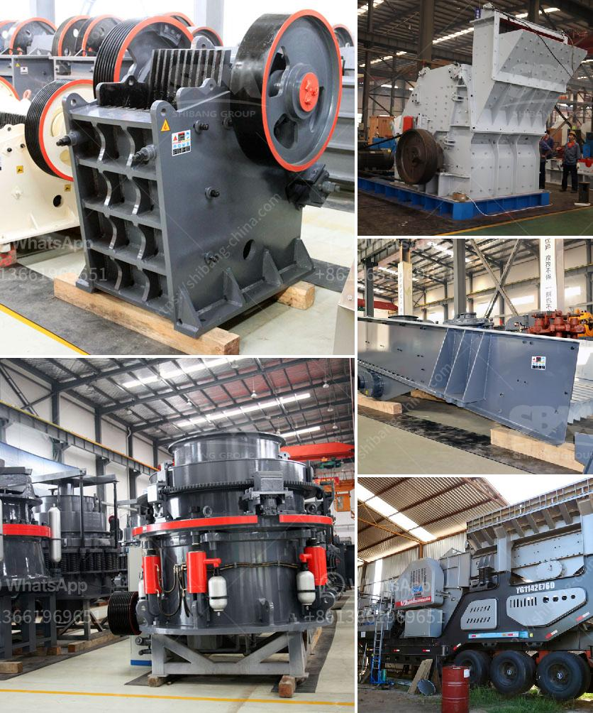

<h3>the product of the stone crusher</h3>
The stone crusher, also known as the stone shredder, is a machine that can crush large pieces of stone into small pieces. It can be used to break down a variety of stones, such as granite, limestone, basalt, and shale. The machine is commonly used in construction projects, such as roads, bridges, and buildings, as well as in mining and quarrying applications.

The stone crusher works by using high pressure to crush the stones. The machine's hydraulic system provides the necessary force to create the needed pressure. Several pistons are positioned around a hydraulic cylinder, which is connected to a motor. The motor is powered by electricity or diesel, depending on the machine’s configuration. As the motor rotates, it drives the piston, which in turn pushes the stones against the walls of the crushing chamber. The stones are crushed and broken into smaller pieces as they come into contact with the walls of the chamber.

One of the key advantages of the stone crusher is its versatility. It can be used to process not only large stones but also smaller ones. This makes it suitable for various applications, including construction, landscaping, and road maintenance. The machine can be easily transported to different job sites, allowing for flexibility in its use.

In addition to its versatility, the stone crusher also offers efficiency and affordability. The machine can generate large amounts of crushed stone quickly, which makes it ideal for projects that require a significant amount of material. Moreover, the machine operates at a relatively low cost, reducing the overall expenses of a project.

Another advantage of the stone crusher is its durability. The machine is built to withstand heavy use and harsh operating conditions. It is constructed with high-quality materials, such as steel and cast iron, which ensure its long-lasting performance. Additionally, the machine requires minimal maintenance, reducing downtime and increasing its productivity.

When it comes to safety, the stone crusher is designed with several safety features to protect the operator and prevent accidents. For example, the machine is equipped with safety sensors that automatically shut it down in the event of any malfunction or unsafe condition. It also has a safety guard around the crushing chamber to prevent stray rocks from flying out and causing injury.

In conclusion, the stone crusher is a versatile and efficient machine that can crush and break down various types of stones. Its durability, affordability, and safety features make it suitable for both small and large-scale construction projects. Whether it be road maintenance or landscaping, the stone crusher provides the necessary crushing power and efficiency to get the job done.
<h3>Contact us</h3><ul><li><strong>Whatsapp:&nbsp;<a href="https://wa.me/8613661969651">+8613661969651</a></strong></li><li><a href="https://swt.shibang-china.com/?git&amp;zhl&amp;the product of the stone crusher"><strong>Online Service(chat now)</strong></a></li></ul><h3>Related</h3><ul><li><a href='crusher plant supplier.md'>crusher plant supplier</a></li><li><a href='limestone crushing.md'>limestone crushing</a></li><li><a href='crushers made in south philippines.md'>crushers made in south philippines</a></li><li><a href='used crusher for sale in south africa.md'>used crusher for sale in south africa</a></li><li><a href='gold refining machine capacity 2 tons per day.md'>gold refining machine capacity 2 tons per day</a></li></ul>