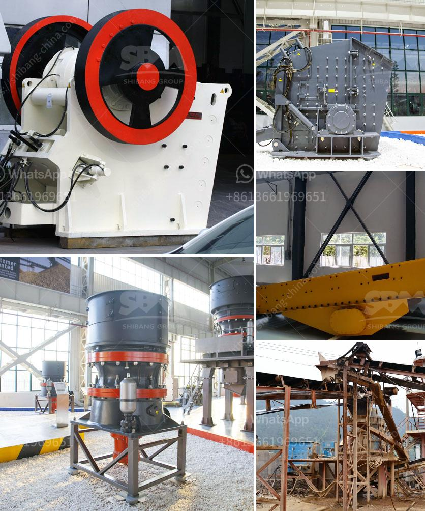

<h3>the standard slag crusher</h3>
Slag is a byproduct of the steelmaking process and is often considered waste material. However, this so-called waste can have significant economic value when properly processed and utilized. The standard slag crusher is an essential tool for any steelmaking operation, as it can efficiently process and dispose of slag, ensuring that valuable resources are not wasted. In this article, we will explore the importance of the standard slag crusher in the context of economic development.

First and foremost, it is crucial to understand the composition and characteristics of slag. Slag is a glass-like byproduct obtained from the smelting of iron ore in a blast furnace. It consists mainly of calcium, magnesium, aluminum, and silica, along with trace amounts of other elements. Due to its high calcium content, slag can be used as a fertilizer in agronomy, and it can also be processed for use in construction materials, such as cement and asphalt.

The standard slag crusher plays a pivotal role in the crushing and processing of slag. Crushing slag efficiently and effectively is vital for any steelmaking operation. The standard slag crusher is designed to crush and grind between 200 and 1000 microns of slag into a fine powder. Once the desired particle size is achieved, the slag can be used in various applications, such as cement production, agricultural fertilizers, and construction materials.

One of the primary advantages of using a standard slag crusher is its ability to recycle materials. By crushing and processing slag, steelmaking facilities can obtain valuable resources that would otherwise be lost. This not only reduces waste but also helps to conserve natural resources, which is critically important from an environmental perspective. Furthermore, by recycling slag, steelmakers can reduce their carbon footprint and contribute to a more sustainable future.

In addition to resource recycling, the standard slag crusher also offers economic benefits. The fine powder produced by the slag crusher can be sold as a raw material to other industries, such as cement manufacturers, who can use it as an additive to improve the strength and durability of their products. This creates a revenue stream for steelmaking facilities and enables them to diversify their income sources.

Moreover, the implementation of a standard slag crusher can contribute to local economic development. Steelmaking operations often generate employment opportunities, and the demand for professional technicians to operate and maintain slag crushers can create additional job prospects. In regions where steelmaking is a significant industry, the establishment of a standard slag crusher can spur economic growth by attracting investments and increasing the competitiveness of the local steel industry.

In conclusion, the standard slag crusher is a vital tool for economic development in the steelmaking industry. By efficiently processing and recycling slag, steelmaking facilities can reduce waste, conserve resources, and generate additional revenue streams. Furthermore, the use of a slag crusher can contribute to local economic development by creating employment opportunities and attracting investments. Therefore, investing in a standard slag crusher is not only economically beneficial but also environmentally responsible, enabling the steelmaking industry to thrive and contribute to sustainable development.
<h3>Contact us</h3><ul><li><strong>Whatsapp:&nbsp;<a href="https://wa.me/8613661969651">+8613661969651</a></strong></li><li><a href="https://swt.shibang-china.com/?git&amp;zhl&amp;the standard slag crusher"><strong>Online Service(chat now)</strong></a></li></ul><h3>Related</h3><ul><li><a href='rock crusher distributors in denver colorado.md'>rock crusher distributors in denver colorado</a></li><li><a href='price list of cone crushers made in china.md'>price list of cone crushers made in china</a></li><li><a href='construction construction belt.md'>construction construction belt</a></li><li><a href='track mounted crushers.md'>track mounted crushers</a></li><li><a href='stone powder making machine in india.md'>stone powder making machine in india</a></li></ul>