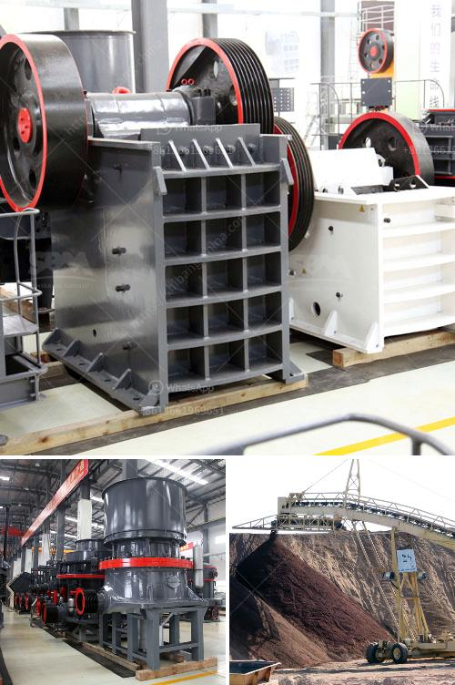

<h3>the vertical mill ireland information</h3>
Ireland has always been known for its rich heritage in manufacturing and industry, and the recent advancements in technology have only further enhanced the country's reputation in this field. One such example is the vertical mill, a game-changer that has revolutionized the manufacturing industry in Ireland.

So, what exactly is a vertical mill? In simple terms, it is a machining tool that utilizes a spindle with a vertical orientation to perform various cutting operations. Unlike horizontal mills, which have a horizontal spindle, vertical mills offer numerous advantages that have made them increasingly popular in Ireland and around the world.

One key advantage of vertical mills is their versatility. These machines can perform a wide range of tasks, including drilling, milling, and cutting. With the ability to handle both single-piece and batch production, they are a flexible solution for manufacturers looking to meet diverse production needs. Moreover, vertical mills can accommodate large workpieces, making them ideal for projects that require machining of larger components.

Another significant advantage of vertical mills is their precision and accuracy. The vertical spindle's perpendicular orientation ensures enhanced stability during machining operations, resulting in more precise cuts and measurements. This level of precision is critical for industries such as aerospace, automotive, and medical device manufacturing, where the smallest deviations can be detrimental to the final product's quality and performance.

Efficiency and productivity are also areas where vertical mills excel. With their upright design, these machines occupy less floor space compared to their horizontal counterparts. This compact footprint translates into better utilization of factory space, allowing manufacturers to maximize their production capacity.

Furthermore, vertical mills often feature specialized software and tools that optimize workflow and minimize manual intervention. This automation not only improves productivity but also reduces the risk of errors or accidents caused by human intervention. In Ireland, where efficiency and productivity are highly valued, these advantages have made vertical mills a preferred choice among manufacturers.

The integration of advanced technologies further enhances the capabilities of vertical mills. Computer Numerical Control (CNC) systems, for instance, allow for precise and automated control of machining operations, leading to better efficiency and consistency. Additionally, many modern vertical mills come equipped with features like tool changers, which enable seamless tool transitions without interrupting the manufacturing process.

Ireland's manufacturing industry has fully embraced the potential of vertical mills. Companies across various sectors, from precision engineering to electronics, have reaped the benefits of these advanced machines. As a result, Irish manufacturers have been able to enhance their competitiveness, deliver high-quality products, and meet the demands of a global market.

In conclusion, the vertical mill has transformed manufacturing in Ireland. Its versatility, precision, efficiency, and integration of advanced technologies have revolutionized the industry, enabling manufacturers to meet the growing demands of the modern world. As Ireland continues to embrace technological advancements, vertical mills will undoubtedly play a crucial role in shaping the country's manufacturing landscape for years to come.
<h3>Contact us</h3><ul><li><strong>Whatsapp:&nbsp;<a href="https://wa.me/8613661969651">+8613661969651</a></strong></li><li><a href="https://swt.shibang-china.com/?git&amp;zhl&amp;the vertical mill ireland information"><strong>Online Service(chat now)</strong></a></li></ul><h3>Related</h3><ul><li><a href='quarry machine manufacturing company in malaysia.md'>quarry machine manufacturing company in malaysia</a></li><li><a href='suppliers of crush or rocks pretoria.md'>suppliers of crush or rocks pretoria</a></li><li><a href='plamnta mobile stone crusher.md'>plamnta mobile stone crusher</a></li><li><a href='how to control partials size in vertical hammer mill.md'>how to control partials size in vertical hammer mill</a></li><li><a href='process flow of bajri washing plant.md'>process flow of bajri washing plant</a></li></ul>