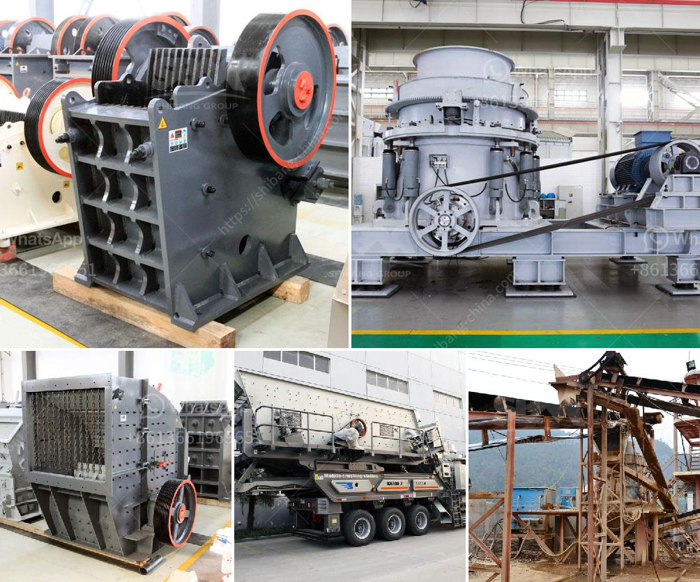

<h3>to 200 tph pe 750 1060 copper ore jaw crusher</h3>
The copper ore jaw crusher is an advanced crushing machine manufactured by HXJQ Machinery. It specializes in the crushing of various types of copper ore and can break the large-scaled copper ore into small-sized particles. The PE750×1060 copper ore jaw crusher is an ideal coarse crushing machine widely used in mining, smelting, building materials, highway, railway, water conservancy, and chemical industries.

With its sturdy and durable structure, reliable performance, low energy consumption, high capacity, and easy maintenance, the PE750×1060 jaw crusher machine has become the preferred equipment in the copper ore processing industry.

One of the key features of this jaw crusher is its ability to process complex ores. It can handle a wide range of minerals, including copper, iron ore, gold, nickel, cobalt, manganese, tin, lead-zinc, and many others. The PE750×1060 model can handle ore blocks with a maximum size of 630mm and compressive strength below 320MPa.

The crushing chamber of the PE750×1060 jaw crusher is deep and has a large feed opening of 750×1060mm, which enables the machine to have a large feeding capacity. With a high crushing ratio and uniform product size, the jaw crusher machine is very efficient in crushing large-sized ores.

Moreover, the PE750×1060 jaw crusher machine utilizes a high-quality bearing, ensuring the smooth operation of the machine and prolonging its service life. The centralized lubrication system provides continuous and reliable lubrication, reducing the downtime for maintenance.

In terms of power, the PE750×1060 jaw crusher machine is powered by a 110kW motor which drives a V-belt and a flywheel. This motor is powerful and provides sufficient energy to crush the copper ores effectively. Additionally, the adjustable discharge port allows users to control the product size, making it customizable according to their needs.

The PE750×1060 jaw crusher machine has a relatively long service life. Its wear parts are made of high-quality wear-resistant materials, which can withstand the strong impact and abrasion during the crushing process. With proper maintenance and regular replacement of wear parts, this jaw crusher machine can operate for a long time without any major issues.

In conclusion, the PE750×1060 copper ore jaw crusher provided by HXJQ Machinery is a high-efficiency, energy-saving, and environmentally friendly crushing equipment for copper ore processing. It can carry out primary, medium, and fine crushing operations on copper ore, and significantly increase crushing productivity and reduce production costs. The reliable performance and low maintenance requirements of this jaw crusher make it an ideal choice for crushing copper ores of various sizes and hardness levels.
<h3>Contact us</h3><ul><li><strong>Whatsapp:&nbsp;<a href="https://wa.me/8613661969651">+8613661969651</a></strong></li><li><a href="https://swt.shibang-china.com/?git&amp;zhl&amp;to 200 tph pe 750 1060 copper ore jaw crusher"><strong>Online Service(chat now)</strong></a></li></ul><h3>Related</h3><ul><li><a href='ball mills in coimbatore.md'>ball mills in coimbatore</a></li><li><a href='stone crusher capacity.md'>stone crusher capacity</a></li><li><a href='ball mill in ceramic industry.md'>ball mill in ceramic industry</a></li><li><a href='flow chart gypsum production.md'>flow chart gypsum production</a></li><li><a href='cara menentukan kapasitas belt conveyor.md'>cara menentukan kapasitas belt conveyor</a></li></ul>