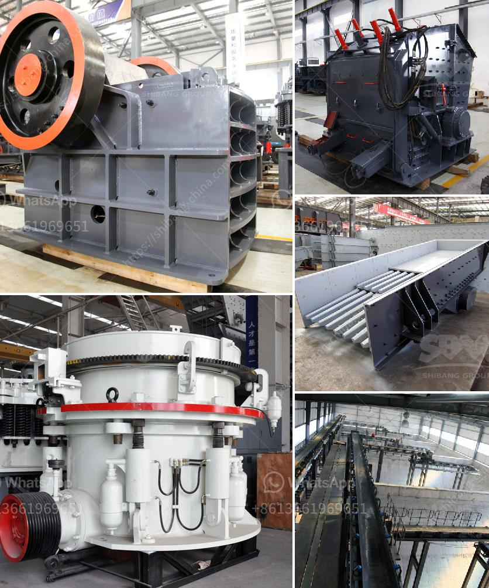

<h3>to buy a coal wash plant in germany</h3>
Germany, renowned for its advanced industrial infrastructure, is not only a key player in the global coal industry but also holds robust environmental policies. Against this backdrop, acquiring a coal wash plant in Germany can be seen as a strategic move, bringing economic and environmental benefits to both the investor and the region. This article will delve into the key advantages and considerations associated with such an investment.

Coal washing, also known as coal beneficiation, is a process that eliminates impurities from coal, resulting in a cleaner and more efficient fuel source. By investing in a coal wash plant in Germany, the investor can gain a competitive edge by providing cleaner, high-quality coal to the market. This will not only reduce combustion emissions but also enhance combustion efficiency, ultimately leading to sustainable and improved coal usage.

Germany has set ambitious targets for transitioning to renewable energy sources. While this shift is underway, coal remains a vital component of the nation's energy mix. Investing in a coal wash plant ensures that coal continues to play a role in the energy transition by providing a more sustainable and environmentally responsible alternative. The washed coal can be used by power plants as a transitional technology, bridging the gap until renewable energy sources can fully supply the nation's energy needs.

Coal washing significantly reduces the release of pollutants such as sulfur dioxide, nitrogen oxide, and mercury, which are harmful to both human health and the environment. As Germany's environmental regulations become stricter, a coal wash plant can help mitigate these concerns and maintain compliance with emission standards. Operating a washed coal plant in accordance with eco-friendly practices can promote responsible coal use while alleviating some of the environmental burdens generally associated with the coal industry.

Investing in a coal wash plant can bring considerable economic benefits to the region, including job creation and increased revenue. The operation requires skilled manpower, from plant technicians to administrative staff, thereby creating employment opportunities and boosting the local economy. Additionally, purchasing a coal wash plant can stimulate ancillary industries, such as transportation and logistics, leading to further economic growth.

Investing in a coal wash plant in Germany is a prudent decision that helps boost the economy, supports the nation's energy transition goals, and mitigates environmental concerns. By producing high-quality, low-emission coal, investors can contribute to sustainable coal use while adhering to Germany's stringent environmental regulations. Moreover, the creation of local employment opportunities further enhances the positive impact of such an investment. As the nation moves towards renewable energy, a coal wash plant can play a crucial role in transitioning Germany towards a cleaner and more sustainable future.
<h3>Contact us</h3><ul><li><strong>Whatsapp:&nbsp;<a href="https://wa.me/8613661969651">+8613661969651</a></strong></li><li><a href="https://swt.shibang-china.com/?git&amp;zhl&amp;to buy a coal wash plant in germany"><strong>Online Service(chat now)</strong></a></li></ul><h3>Related</h3><ul><li><a href='jual crusher batubara di indonesia.md'>jual crusher batubara di indonesia</a></li><li><a href='crusher stone prices peru.md'>crusher stone prices peru</a></li><li><a href='jaw crusher 10 x 20.md'>jaw crusher 10 x 20</a></li><li><a href='chromite processing plant and separation machine.md'>chromite processing plant and separation machine</a></li><li><a href='m sand manufacturing project report.md'>m sand manufacturing project report</a></li></ul>