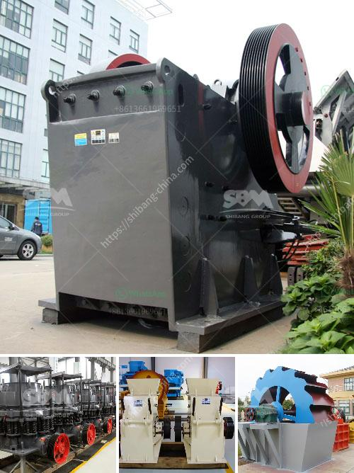

<h3>to buy a second hand mobile stone crusher plant india</h3>
Are you planning to buy a second-hand mobile stone crusher plant India? It is a wise choice for those who have limited budget and need to maximize their investment. While buying used equipment has its own risks, purchasing from a reputable seller can help you ensure that you're getting a high-quality product at an affordable price.

The demand for stone crusher plants is continuously increasing in India due to the expansion of infrastructure projects, such as highways, railways, and canals. This has led to a surge in the production of construction aggregates, resulting in a growing need for crushers. Buying a used mobile stone crusher plant can be advantageous for several reasons.

First, the cost of shipping a new plant is prohibitive, making it more economical to purchase a used unit. Second, if you're buying from a trusted seller, you can be confident that the equipment has been maintained properly and is in good working condition. Reputable sellers often provide detailed information about the condition of the machinery, including any repairs or replacements that have been made. This transparency allows buyers to make an informed decision.

In addition, buying a second-hand mobile stone crusher plant gives you the opportunity to explore different models and brands before making a final decision. With a wide range of options available, you can compare the specifications, features, and prices of different crushers to find the one that best suits your needs and budget.

Before finalizing your purchase, it is essential to conduct a thorough inspection of the machinery. This can be done by hiring a professional or bringing along someone with technical knowledge. Evaluating the overall condition of the crusher, including its engine, conveyor belts, electrical system, and hydraulic components, will help you determine if it is worth investing in.

Lastly, when buying a second-hand mobile stone crusher plant, it is essential to consider the after-sales service provided by the seller. Ensure they offer a warranty or guarantee to protect you against any potential defects or malfunctions that may arise after the purchase.

In conclusion, buying a second-hand mobile stone crusher plant in India can be a great investment as it allows you to maximize your budget while still acquiring a high-quality product. By purchasing from a reputable seller and conducting a thorough inspection, you can ensure a cost-effective and reliable crushing solution for your construction projects.
<h3>Contact us</h3><ul><li><strong>Whatsapp:&nbsp;<a href="https://wa.me/8613661969651">+8613661969651</a></strong></li><li><a href="https://swt.shibang-china.com/?git&amp;zhl&amp;to buy a second hand mobile stone crusher plant india"><strong>Online Service(chat now)</strong></a></li></ul><h3>Related</h3><ul><li><a href='limestone powder manufacture machine.md'>limestone powder manufacture machine</a></li><li><a href='jaw crushers for sale in zimbabwe.md'>jaw crushers for sale in zimbabwe</a></li><li><a href='ball mill feed spout sale.md'>ball mill feed spout sale</a></li><li><a href='graphite ore buyers in india.md'>graphite ore buyers in india</a></li><li><a href='hammer mill mining south africa.md'>hammer mill mining south africa</a></li></ul>