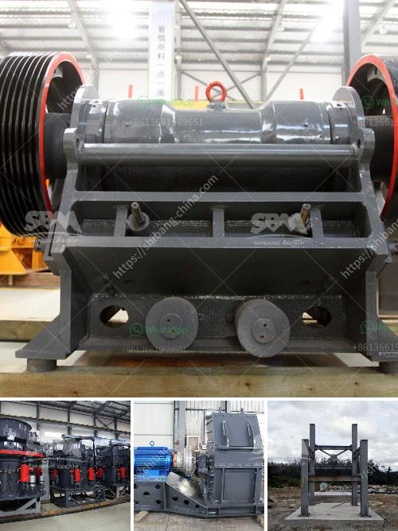

<h3>ton per day crusher barmac</h3>
The Barmac crusher, developed by New Zealand entrepreneur Bryan Bartley and first used in 1970, is a common name for the Barmac vertical shaft impact (VSI) crusher. It's primarily utilized for reducing the size of aggregate and shaping the particles in desired sizes, thus making it a promising alternative to many traditional crushing equipment.

The Barmac crusher operates on a rock-on-rock crushing principle. Rocks are fed into the center of the crusher, where they are accelerated and thrown towards a series of anvils or pockets lining the crushing chamber. The high velocity of the rocks provides a perfect opportunity for them to collide and break into smaller pieces.

One of the main advantages of the Barmac crusher is its ability to produce cubical-shaped end products. This is crucial, especially when it comes to the production of high-quality aggregates for the construction industry. Traditional cone crushers often produce flaky or elongated particles, which can result in a suboptimal end product. However, the Barmac crusher ensures that the final product has a consistent shape, size, and gradation, making it ideal for use in a variety of applications.

In terms of its capacity, the Barmac crusher can handle varying tonnages. For instance, the Barmac B6150SE model can handle up to 320 tons per hour. With a typical feed size of 0-50 mm, this machine is capable of producing a high-quality sand product of 0-2.5 mm at a rate of 250 tons per hour. It's important to note that the capacity may vary depending on the type of material being crushed and the required end product specifications.

Another noteworthy feature of the Barmac crusher is its low operating costs. Due to its rock-on-rock crushing principle, the machine consumes significantly less energy compared to traditional cone or impact crushers. This helps operators save on electricity bills and reduce their carbon footprint. Additionally, the Barmac crusher requires fewer wear parts, resulting in lower maintenance costs and downtime.

The Barmac crusher has been widely adopted in various industries, including mining, construction, aggregate production, and recycling. Its versatility and efficiency make it an attractive option for crushing different types of materials, from hard and abrasive rocks to softer, less demanding ones.

In conclusion, the Barmac crusher is a reliable and efficient crushing solution that offers several benefits, including high-quality end products, low operating costs, and reduced environmental impact. With its ability to handle varying tonnages, it proves to be a versatile choice for different applications. As technology continues to advance, the Barmac crusher is expected to evolve further, delivering even greater performance and productivity for its users.
<h3>Contact us</h3><ul><li><strong>Whatsapp:&nbsp;<a href="https://wa.me/8613661969651">+8613661969651</a></strong></li><li><a href="https://swt.shibang-china.com/?git&amp;zhl&amp;ton per day crusher barmac"><strong>Online Service(chat now)</strong></a></li></ul><h3>Related</h3><ul><li><a href='new technology ball mill factories europe.md'>new technology ball mill factories europe</a></li><li><a href='calcium carbonate powder making equipment in germany.md'>calcium carbonate powder making equipment in germany</a></li><li><a href='cement plant cost estimation cement plant cost.md'>cement plant cost estimation cement plant cost</a></li><li><a href='malaysia mineral ball mill.md'>malaysia mineral ball mill</a></li><li><a href='cornerstone equipment inc used rock crushers.md'>cornerstone equipment inc used rock crushers</a></li></ul>