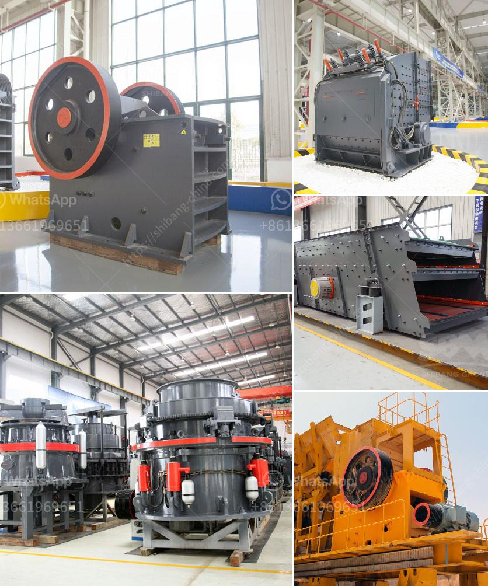

<h3>ton per day gold processing plant</h3>
Gold has remained an esteemed and sought-after precious metal for centuries, attracting investors, jewelry enthusiasts, and mining companies alike. Extracting gold from ore is an intricate process that requires advanced technology and expertise. In this article, we delve into the world of gold mining and explore the potential of a 1-ton-per-day gold processing plant. 

A 1-ton-per-day gold processing plant is an efficient and cost-effective solution for artisanal and small-scale gold miners. These plants are designed to crush and grind gold-bearing ore, extract the precious metal, and produce a gold bullion product that can be sold directly to the market or further refined into gold bars or other forms of products.

The efficiency of a 1-ton-per-day gold processing plant lies in its ability to handle small-scale operations while still achieving high recovery rates. These plants utilize a combination of crushing, grinding, and gravity separation techniques to extract the gold particles from the ore. Many plants also employ cyanide leaching or other chemical processes to maximize the recovery of gold.

One of the significant benefits of a small-scale gold processing plant is its relatively low cost compared to larger mining operations. These plants often utilize inexpensive and locally available equipment, reducing the capital investment required. Moreover, they provide a more environmentally friendly alternative to traditional mining methods, minimizing the use of harmful chemicals and reducing the impact on local ecosystems.

When setting up a 1-ton-per-day gold processing plant, several key factors need to be considered. Firstly, the location of the plant is crucial to ensure access to the ore source and availability of water and electricity. Efficient transportation methods are also essential to transport the processed ore and gold products to market or refineries.

The plant should include primary and secondary crushers, ball mills or rod mills for grinding, various sizes of flotation cells or gold concentrators for separation, and tanks for cyanide leaching processes if used. Additionally, safety measures, including dust and noise control measures, should be implemented to protect workers and the surrounding environment.

While a 1-ton-per-day gold processing plant serves small-scale operations effectively, some artisanal miners may have aspirations to expand their production capacity. Scaling up operations may involve replicating the existing plant or transitioning to a larger-scale operation. This could include increasing the size of crushers, mills, and flotation cells, as well as incorporating more advanced technologies like carbon-in-pulp or carbon-in-leach processes.

The potential of a 1-ton-per-day gold processing plant is undeniable, offering a sustainable and economically viable solution to many small-scale gold miners worldwide. These plants combine efficiency, cost-effectiveness, and environmental considerations, enabling miners to extract gold and generate income while minimizing the impact on the local ecosystem.

As the demand for gold continues to rise, it is essential to support and promote responsible mining practices among artisanal and small-scale gold miners. The establishment of small-scale gold processing plants can contribute to achieving this goal, empowering local communities to thrive while preserving the natural resources and beauty of our planet.
<h3>Contact us</h3><ul><li><strong>Whatsapp:&nbsp;<a href="https://wa.me/8613661969651">+8613661969651</a></strong></li><li><a href="https://swt.shibang-china.com/?git&amp;zhl&amp;ton per day gold processing plant"><strong>Online Service(chat now)</strong></a></li></ul><h3>Related</h3><ul><li><a href='top ten manufacturers of stone crusher in the world.md'>top ten manufacturers of stone crusher in the world</a></li><li><a href='ball mill in mining.md'>ball mill in mining</a></li><li><a href='hammer crusher parameters introduced in detail.md'>hammer crusher parameters introduced in detail</a></li><li><a href='jaw crusher 10 x 36 sulit.md'>jaw crusher 10 x 36 sulit</a></li><li><a href='gypsum beneficiation plant.md'>gypsum beneficiation plant</a></li></ul>