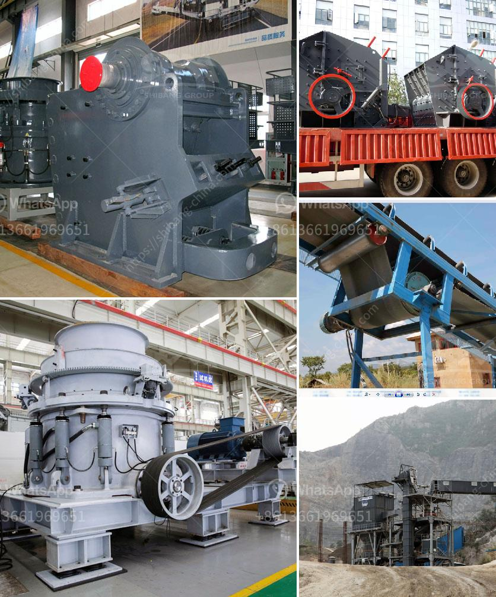

<h3>tons per year gypsum powder production line</h3>
Gypsum powder has a wide range of applications in various industries, such as construction, agriculture, and chemical. With the increasing demand for gypsum powder, the need for efficient production lines has also grown significantly. A tons per year gypsum powder production line is designed to meet this growing demand and ensure a steady supply of high-quality gypsum powder.

A tons per year gypsum powder production line typically consists of several steps, starting with the raw gypsum material being crushed and ground into a fine powder. This powder is then heated in a kiln to remove any remaining moisture and create the desired consistency and quality. The heated powder is then cooled, bagged, and ready for distribution.

The key equipment in a tons per year gypsum powder production line includes crushers, grinding mills, calcining equipment, and packaging machinery. These machines work together to process the raw gypsum material and transform it into a fine powder that meets the specifications and requirements of different industries.

Crushers such as jaw crushers and impact crushers are used to break down the raw gypsum material into smaller pieces. These crushers have high crushing efficiency and can handle large quantities of gypsum.

Grinding mills, such as ball mills and Raymond mills, are used to grind the crushed gypsum material into a fine powder. These mills have different capacities and can produce different particle sizes of gypsum powder.

Calcining equipment, such as rotary kilns, are used to heat the ground gypsum powder to remove any remaining moisture and create the desired consistency and quality. These calcining processes also enhance the chemical and physical properties of the gypsum powder.

Packaging machinery is used to package the finished gypsum powder into bags or containers for transportation and distribution. This machinery ensures that the gypsum powder remains dry and protected during storage and shipping.

A tons per year gypsum powder production line can produce a large quantity of gypsum powder, typically ranging from 30,000 to 100,000 tons per year. This production capacity allows for a steady and continuous supply of gypsum powder to meet the demands of various industries.

With advancements in technology, newer production lines are becoming more efficient and environmentally friendly. These production lines incorporate energy-saving features and utilize waste heat from the calcining processes, reducing overall energy consumption and emissions. Additionally, dust collection systems are implemented to minimize dust emissions and create a safer working environment.

In conclusion, a tons per year gypsum powder production line is essential to meet the increasing demand for gypsum powder in various industries. This production line is designed to efficiently process raw gypsum material into a fine powder that meets industry specifications. With advancements in technology, newer production lines are more efficient and environmentally friendly. Investing in a tons per year gypsum powder production line ensures a reliable supply of high-quality gypsum powder for industrial applications.
<h3>Contact us</h3><ul><li><strong>Whatsapp:&nbsp;<a href="https://wa.me/8613661969651">+8613661969651</a></strong></li><li><a href="https://swt.shibang-china.com/?git&amp;zhl&amp;tons per year gypsum powder production line"><strong>Online Service(chat now)</strong></a></li></ul><h3>Related</h3><ul><li><a href='mobile crusher in the coal mining.md'>mobile crusher in the coal mining</a></li><li><a href='stone crusher guptas.md'>stone crusher guptas</a></li><li><a href='denver roll crusher for sale.md'>denver roll crusher for sale</a></li><li><a href='screening equipment mining vibrating screen for sale.md'>screening equipment mining vibrating screen for sale</a></li><li><a href='malaysia industrial mill.md'>malaysia industrial mill</a></li></ul>