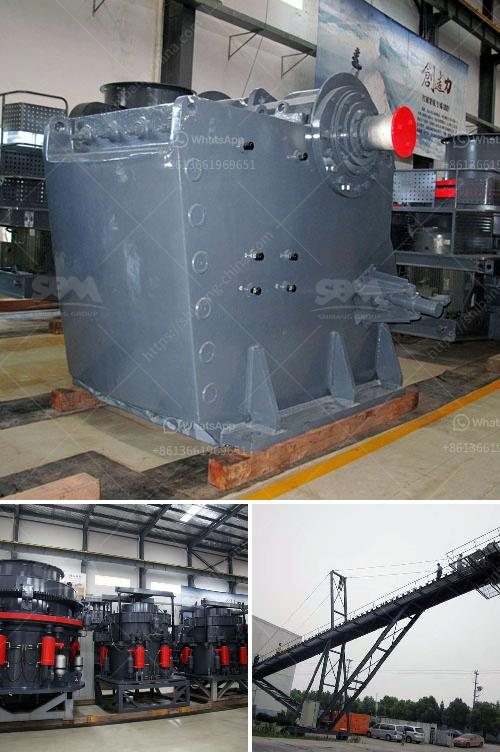

<h3>top mining equipment supplier in south africa</h3>
South Africa is renowned for its abundant mineral resources, contributing significantly to its economy. At the heart of the mining industry lies a myriad of mining equipment suppliers, each vying for a slice of the market share. These suppliers play a crucial role in ensuring the efficient operation and productivity of mining operations throughout the country. In this article, we will explore some of the top mining equipment suppliers in South Africa.

One of the leading mining equipment suppliers in South Africa is BME. Formed over 25 years ago, BME has established itself as a formidable player in the mining industry. They boast a wide range of technologically advanced products and services, catering to both underground and surface mining operations. BME’s offerings include bulk emulsion plants, electronic detonators, initiating systems, and blasting accessories. With a strong focus on innovation and safety, BME has become a trusted supplier to many mining companies in South Africa.

Another key player in the mining equipment sector is Becker Mining South Africa. Becker Mining South Africa specializes in the design, manufacturing, and supply of mine safety and automation systems. They offer an impressive portfolio of products, including proximity detection systems, collision avoidance systems, and conveyor safety switches. Becker Mining South Africa’s commitment to safety is evident in their vision to improve productivity by eliminating accidents.

Multotec is renowned for its expertise in mineral processing solutions. They provide a wide range of innovative products and services, ensuring optimal mineral processing efficiency. Multotec’s offerings include cyclones, magnetic separators, samplers, and wear solutions. With their extensive experience in the field, Multotec has become a reliable partner to many mining companies operating in South Africa.

Imilingo Mineral Processing is another leading mining equipment supplier in South Africa. Imilingo specializes in innovative and cost-effective mineral processing solutions. In addition to supplying state-of-the-art equipment, Imilingo offers comprehensive services such as test work, engineering design, project management, and training. Their commitment to sustainable mining practices sets them apart from their competitors.

The aforementioned companies are just a few of the numerous mining equipment suppliers in South Africa. Each company brings something unique to the table, whether it be innovative technology, exceptional service, or a commitment to safety and sustainability. Together, these suppliers play a vital role in driving the growth and success of the mining industry in South Africa.

In conclusion, South Africa is home to a wide array of mining equipment suppliers, with each company striving to stay ahead of the competition. BME, Becker Mining South Africa, Multotec, and Imilingo Mineral Processing are among the top mining equipment suppliers in the country. These companies have established themselves as key players in the industry, providing innovative solutions and ensuring the safe and efficient operation of mining operations. With their expertise and commitment to excellence, these suppliers are a crucial asset to the mining industry in South Africa.
<h3>Contact us</h3><ul><li><strong>Whatsapp:&nbsp;<a href="https://wa.me/8613661969651">+8613661969651</a></strong></li><li><a href="https://swt.shibang-china.com/?git&amp;zhl&amp;top mining equipment supplier in south africa"><strong>Online Service(chat now)</strong></a></li></ul><h3>Related</h3><ul><li><a href='iron crushing equipment cost.md'>iron crushing equipment cost</a></li><li><a href='calcium carbonate powder crushing crusher usa.md'>calcium carbonate powder crushing crusher usa</a></li><li><a href='stone crushing equipment available.md'>stone crushing equipment available</a></li><li><a href='cement plants in west bengal list.md'>cement plants in west bengal list</a></li><li><a href='station de concasassage theniet elhad.md'>station de concasassage theniet elhad</a></li></ul>